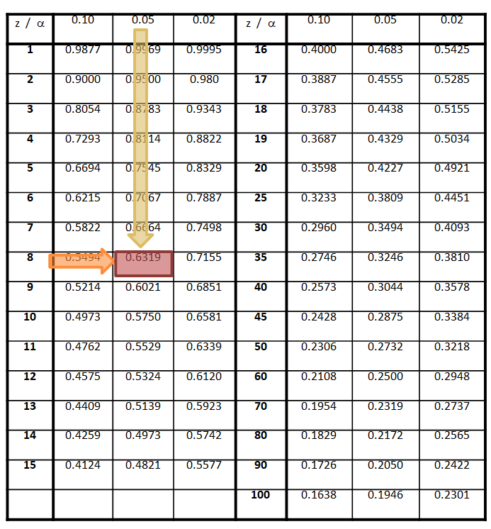
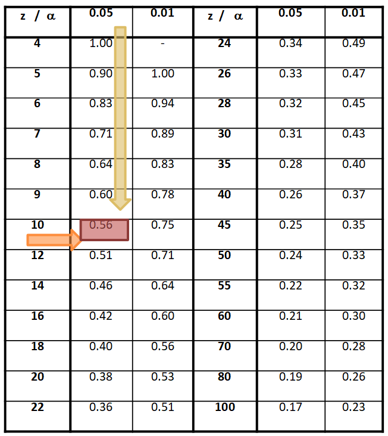

```{r setup, global_options,include=FALSE}
knitr::opts_chunk$set(
  dpi = 200,
  #fig.width = 7,
  #fig.height = 4,
  strip.white = T,
  #dev = "png",
  #dev.args = list(png = list(bg = "transparent")),
  message=FALSE,
  comment=NA,
  echo=FALSE,
  warning=FALSE,
  eval=TRUE
  
)
```

```{r include=FALSE}
source('./assets/functions.R')

# Les librairies
requiredPackages = c('knitr','datasets','kableExtra','ggplot2','gridExtra',
                     'plotly','widgetframe','sn','reshape','dplyr','dotenv')
PackageFacile(requiredPackages)

load_dot_env(".env")
annee=Sys.getenv("annee")

sdp <- function(x) sqrt(mean((x-mean(x))^2))

```


class: center, middle, inverse, title-slide, animated, fadeIn
# Analyse de données L3 `r annee`
# Cours n°4- La corrélation<br /> <br />
### Florian Bayer


<div class="my-footer"><span>Université Paris 1 Panthéon Sorbonne - L3 `r annee` : analyse de données - Florian Bayer</span></div> 

---
class: animated, fadeIn
## Rappels et objectifs du cours
<div class="my-footer"><span>Université Paris 1 Panthéon Sorbonne - L3 `r annee` : analyse de données - Florian Bayer</span></div> 

Lors du précédent cours, nous avons vu comment vérifier l’existence d’une relation entre deux caractères discrets à l’aide du $\chi^2$.

--

Pour la plupart des caractères **quantitatifs**, le $\chi^2$ n’est pas utilisable, sauf si on discrétise la série de données (Age $\rightarrow$ classes d’âges).

On utilise donc un autre outil statistique pour mesurer **l'intensité de la relation** entre deux caractères quantitatifs continus : le **coefficient de corrélation**.

Il est complémentaire à la **régression linéaire** et à la régression multiple qui visent à résumer et/ou **modéliser** un phénomène par une ou plusieurs variables.

--

En géographie, **identifier** puis **modéliser** des **relations** permet de comprendre un phénomène sur un espace donné, de prévoir la survenue de ce phénomène ou encore de déterminer les variables qui manquent à notre explication.

---
class: inverse, center, middle, animated, fadeIn  
# 1- La corrélation


<div class="my-footer-title "></div> 

---
class: animated, fadeIn
## Relation et dépendance 
<div class="my-footer"><span>Université Paris 1 Panthéon Sorbonne - L3 `r annee` : analyse de données - Florian Bayer</span></div> 

.pull-left[

.font80[
Une relation entre deux caractères quantitatifs $x$ et $y$ peut-être mesurée si l'attribution des valeurs de $y$ *dépendent* des valeurs de $x$ ou inversement. 

Par exemple, lorsque $x$ augmente de 1, $y$ augmente aussi de 1. Autrement dit, il y a une **relation** si les valeurs de $x$ ne sont font pas au hasard par rapport au valeurs de $y$.

Si $y$ dépend de $x$, on peut prédire avec une certaine marge d’erreur les valeurs de $y$ en connaissant les valeurs de $x$ à l'aide d'une fonction $y=f(x)$ : 

Exemple : 

Il existe une relation entre la température et l'altitude, exprimée par l’équation :
$T_a = -0.006a + T_0$
- $T_a$ : température à l'altitude a
- $a$ : altitude en mètre
- $T_0$ : température au niveau de la mer. 

Tous les **1 m**, la température **baisse de 0,006 °C** (0.6 °C tous les 100 m)
]]

.pull-right[
```{r echo=FALSE, out.width="100%"}

x <- c(2000,1500,1000,500,1000,1500,2000,2500)
y <- c(0,3,6,10,8,5,2,-2)
df <- data.frame(x, y)

ggplot(df, aes(x, y))+geom_abline(intercept = 13, slope = -0.006) + geom_point(color='darkred',size =5) + 
  labs(title="Relation entre la température et l'altitude",x="altitude(m)",y = 'Température (°c)')+
  xlim(0, 3000)+ ylim(-2, 13)+theme(text = element_text(size=15))

```

]

---
class: animated, fadeIn
## Relation et dépendance 
<div class="my-footer"><span>Université Paris 1 Panthéon Sorbonne - L3 `r annee` : analyse de données - Florian Bayer</span></div> 

La notation des variables est importante. Si vous écrivez $y=f(x)$, vous postulez: 
- que $y$ est la variable à **expliquer**. On parle de variable **dépendante**.
- que $x$ est la variable **explicative**. On parle de variable **indépendante**.

--

S'il existe une relation, les valeurs de $x$ permettront de prédire les valeurs de $y$ alors que la réciproque n'est pas toujours vrai. Il faut donc être rigoureux et précis lors de l’énoncé de votre hypothèse et **réfléchir au sens de la dépendance**.

--

Afin de mesurer cette éventuelle relation, il est nécessaire :
- de la visualiser sa **forme** à l'aide d'un graphique : le **diagramme de corrélation**.
- de mesurer son **intensité** et son **signe**, à l'aide d'un **coefficient de corrélation**, qu'il faudra ensuite tester significativement.
- dans certains cas, de **modéliser** la relation à l'aide d'une droite d'équation : la **régression linéaire**.

---
class: animated, fadeIn
## Interprétations graphiques
<div class="my-footer"><span>Université Paris 1 Panthéon Sorbonne - L3 `r annee` : analyse de données - Florian Bayer</span></div> 

En croisant les valeurs de $x$ et de $y$ sur un graphique, on forme un nuage de points dont la forme permet de caractériser la relation à via son <span style="color:#FF6B6B">**intensité**</span>, sa <span style="color:#4b8b8b">**forme**</span> et son <span style="color:#FF9F1C">**signe**</span>.

```{r echo=FALSE, out.width="49%"}

seed = 1
x <- sample(1:100, 100, replace=FALSE)
y <- x+rnorm(100, mean=0, sd=1)
dfr1 <- data.frame(x, y,"Relation forte")
colnames(dfr1)[3] <- "Relation"

g1<- ggplot(dfr1, aes(x, y)) + geom_point(color='#FF6B6B') +
  expand_limits(x = 0, y = 0) +
  labs(title="Relation forte",x ="",y="")+
  xlim(c(0,100))+
  ylim(c(0,100))+
  theme(aspect.ratio = 1)

x <- sample(1:100, 100, replace=FALSE)
y <- x+rnorm(100, mean=3, sd=15)
dfr2 <- data.frame(x, y,"Relation moyenne")
colnames(dfr2)[3] <- "Relation"

g2<- ggplot(dfr2, aes(x, y)) + geom_point(color='#FF6B6B') +
  expand_limits(x = 0, y = 0) +
  labs(title="Relation moyenne",x ="",y="")+
  xlim(c(0,100))+
  ylim(c(0,100))+
  theme(aspect.ratio = 1)

x <- sample(1:100, 100, replace=FALSE)
y <- sample(1:100, 100, replace=FALSE)
dfr3 <- data.frame(x, y,"Relation nulle")
colnames(dfr3)[3] <- "Relation"

g3<- ggplot(dfr3, aes(x, y)) + geom_point(color='#FF6B6B') +
  expand_limits(x = 0, y = 0) +
  labs(title="Relation nulle",x ="",y="")+
  xlim(c(0,100))+
  ylim(c(0,100))+
  theme(aspect.ratio = 1)

x <- c(1,2,3,4,5,6,7,8,9,10)
y <- x+rnorm(10, mean=0, sd=0.02)
dff1 <- data.frame(x, y,"Linéaire")
colnames(dff1)[3] <- "Forme"

g4 <- ggplot(dff1, aes(x, y)) + geom_point(color='#4b8b8b') +
  expand_limits(x = 0, y = 0) +
  labs(title="Forme linéaire",x ="",y="")+
  xlim(c(0,10))+
  ylim(c(0,10))+
  theme(aspect.ratio = 1)

x <- c(1,2,3,4,5,6,7.5,8.3,9.5,10)
y <- c(1,1.25,1.75,2.25,3,4,6,7,9,10)
dff2 <- data.frame(x, y,"Forme non linéaire")
colnames(dff2)[3] <- "Forme"

g5 <- ggplot(dff2, aes(x, y)) + geom_point(color='#4b8b8b') +
  expand_limits(x = 0, y = 0) +
  labs(title="Non linéaire",x ="",y="")+
  xlim(c(0,10))+
  ylim(c(0,10))+
  theme(aspect.ratio = 1)

x <- c(1,2,3,4,5,6,7,8,9,10)
y <- c(9,5,3,1.5,1,1,1.5,3,5,9)
dff3 <- data.frame(x, y,"Non linéaire non monotone")
colnames(dff3)[3] <- "Forme"

g6 <- ggplot(dff3, aes(x, y)) + geom_point(color='#4b8b8b') +
  expand_limits(x = 0, y = 0) +
  labs(title="Non linéaire non monotone",x ="",y="")+
  xlim(c(0,10))+
  ylim(c(0,10))+
  theme(aspect.ratio = 1)


x <- c(1,2,3,4,5,6,7,8,9,10)
y <- x+rnorm(10, mean=0, sd=0.02)
dfs1 <- data.frame(x, y,"Monotone positive")
colnames(dfs1)[3] <- "Signe"

g7 <- ggplot(dfs1, aes(x, y)) + geom_point(color='#FF9F1C') +
  expand_limits(x = 0, y = 0) +
  labs(title="Monotone positive",x ="",y="")+
  xlim(c(0,10))+
  ylim(c(0,10))+
  theme(aspect.ratio = 1)

x <- c(1,2,3,4,5,6,7,8,9,10)
y <- rev(x)
dfs2 <- data.frame(x, y,"Monotone négative")
colnames(dfs2)[3] <- "Signe"

g8 <- ggplot(dfs2, aes(x, y)) + geom_point(color='#FF9F1C') +
  expand_limits(x = 0, y = 0) +
  labs(title="Monotone négative",x ="",y="")+
  xlim(c(0,10))+
  ylim(c(0,10))+
  theme(aspect.ratio = 1)

grid.arrange(g1,g2,g3,
            ncol=2, nrow = 2)

# df1 <- rbind(dfr1,dfr2,dfr3)
# df2 <- rbind(dff1,dff2,dff3)
# df3 <- rbind(dfs1,dfs2)
# 
# facet1 <- ggplot(df1, aes(x, y)) + geom_point(color='#4b8b8b') +
#   facet_grid(. ~ Relation) +
#   expand_limits(x = 0, y = 0) +
#   labs(title="",x ="",y="")+
#   xlim(c(0,10))+
#   ylim(c(0,10))+
#   theme(aspect.ratio = 1)
# 
# facet2 <- ggplot(df2, aes(x, y)) + geom_point(color='#4b8b8b') +
#   facet_grid(. ~ Forme) +
#   expand_limits(x = 0, y = 0) +
#   labs(title="",x ="",y="")+
#   xlim(c(0,10))+
#   ylim(c(0,10))+
#   theme(aspect.ratio = 1)
# 
# facet3 <- ggplot(df3, aes(x, y)) + geom_point(color='#4b8b8b') +
#   facet_grid(. ~ Signe) +
#   expand_limits(x = 0, y = 0) +
#   labs(title="",x ="",y="")+
#   xlim(c(0,10))+
#   ylim(c(0,10))+
#   theme(aspect.ratio = 1)
# 
# grid.arrange(facet1,facet2,facet3, ncol=1, nrow = 3)

```
```{r echo=FALSE, out.width="49%"}

seed = 1
x <- c(1,2,3,4,5,6,7,8,9,10)
y <- x+rnorm(10, mean=0, sd=0.02)
dff1 <- data.frame(x, y,"Monotone linéaire")
colnames(dff1)[3] <- "Forme"

g4 <- ggplot(dff1, aes(x, y)) + geom_point(color='#4b8b8b') +
  expand_limits(x = 0, y = 0) +
  labs(title="Linéaire",x ="",y="")+
  xlim(c(0,10))+
  ylim(c(0,10))+
  theme(aspect.ratio = 1)

x <- c(1,2,3,4,5,6,7.5,8.3,9.5,10)
y <- c(1,1.25,1.75,2.25,3,4,6,7,9,10)
dff2 <- data.frame(x, y,"Monotone non linéaire")
colnames(dff2)[3] <- "Forme"

g5 <- ggplot(dff2, aes(x, y)) + geom_point(color='#4b8b8b') +
  expand_limits(x = 0, y = 0) +
  labs(title="Non linéaire",x ="",y="")+
  xlim(c(0,10))+
  ylim(c(0,10))+
  theme(aspect.ratio = 1)

x <- c(1,2,3,4,5,6,7,8,9,10)
y <- c(9,5,3,1.5,1,1,1.5,3,5,9)
dff3 <- data.frame(x, y,"Non linéaire non monotone")
colnames(dff3)[3] <- "Forme"

g6 <- ggplot(dff3, aes(x, y)) + geom_point(color='#4b8b8b') +
  expand_limits(x = 0, y = 0) +
  labs(title="Non linéaire non monotone",x ="",y="")+
  xlim(c(0,10))+
  ylim(c(0,10))+
  theme(aspect.ratio = 1)


grid.arrange(g4,g5,g6,
            ncol=2, nrow = 2)

```

---
class: animated, fadeIn
## Interprétations graphiques
<div class="my-footer"><span>Université Paris 1 Panthéon Sorbonne - L3 `r annee` : analyse de données - Florian Bayer</span></div> 

.center-img[
```{r echo=FALSE, out.width="65%"}

seed = 1

x <- c(1,2,3,4,5,6,7,8,9,10)
y <- x+rnorm(10, mean=0, sd=0.02)
dfs1 <- data.frame(x, y,"Monotone positive")
colnames(dfs1)[3] <- "Signe"

g7 <- ggplot(dfs1, aes(x, y)) + geom_point(color='#FF9F1C') +
  expand_limits(x = 0, y = 0) +
  labs(title="Monotone linéaire positive",x ="",y="")+
  expand_limits(x = 0, y = 0) +
  theme(aspect.ratio = 1)

x <- c(1,2,3,4,5,6,7,8,9,10)
y <- rev(x)
dfs2 <- data.frame(x, y,"Monotone linéaire négative")
colnames(dfs2)[3] <- "Signe"

g8 <- ggplot(dfs2, aes(x, y)) + geom_point(color='#FF9F1C') +
  expand_limits(x = 0, y = 0) +
  labs(title="Monotone négative",x ="",y="")+
  expand_limits(x = 0, y = 0) +
  theme(aspect.ratio = 1)


x <- c(1,2,3,4,5,6,7.5,8.3,9.5,10)
y <- c(1,1.25,1.75,2.25,3,4,6,7,9,10)
dfs3 <- data.frame(x, y,"Monotone positive")
colnames(dfs3)[3] <- "Signe"

g9 <- ggplot(dfs3, aes(x, y)) + geom_point(color='#FF9F1C') +
  expand_limits(x = 0, y = 0) +
  labs(title="Monotone non linéaire positive",x ="",y="")+
  expand_limits(x = 0, y = 0) +
  theme(aspect.ratio = 1)

x <- c(1.5,2,3,4,5,6,7.5,8.3,9.5,10)
y <- rev(c(1.15,1.25,1.75,2.25,3,4,5,7,8.5,10))
dfs4 <- data.frame(x, y,"Monotone positive")
colnames(dfs3)[3] <- "Signe"

g10 <- ggplot(dfs4, aes(x, y)) + geom_point(color='#FF9F1C') +
  expand_limits(x = 0, y = 0) +
  labs(title="Monotone non linéaire positive",x ="",y="")+
  expand_limits(x = 0, y = 0) +
  theme(aspect.ratio = 1)


grid.arrange(g7,g8,g9,g10,
            ncol=2, nrow = 2)

```
]

---
class: animated, fadeIn
## Relation et dépendance
<div class="my-footer"><span>Université Paris 1 Panthéon Sorbonne - L3 `r annee` : analyse de données - Florian Bayer</span></div> 

Une fois que la relation entre $x$ et $y$ est entrevue graphiquement, il est possible de mesurer **l'intensité** de la relation à l'aide du **coefficient de corrélation** noté $R$.

--

Outre l'intensité d'une relation monotone, il renseigne également sur son **signe.** 

Il existe plusieurs coefficients de corrélation. Les plus utilisées sont:
- Le coefficient de corrélation de **Pearson** qui permet d'analyser les **relations linéaires**. Il est en lien avec la **régression linéaire**.
- Le coefficient de corrélation de **Spearman** qui permet d'analyser les **relations non-linéaires monotones**. Il est aussi appelé coefficient de corrélation de rang. 

.center-img[
.pull-left[
```{r echo=FALSE, out.width="40%"}

```
] 

.pull-right[
```{r echo=FALSE, out.width="35%"}

```
] 
]


---
class: inverse, center, middle, animated, fadeIn  
# 2- Le coefficient de corrélation linéaire de Bravais-Pearson


<div class="my-footer-title "></div> 

---
class: animated, fadeIn
## La covariance
<div class="my-footer"><span>Université Paris 1 Panthéon Sorbonne - L3 `r annee` : analyse de données - Florian Bayer</span></div> 

Le coefficient de corrélation linéaire de Bravais-Pearson permet de détecter la présence ou l'absence d'une **relation monotone linéaire** entre deux caractères quantitatifs continus. 

**Il est mal adapté aux relations non-linéaires.** 

--

Pour calculer ce coefficient il faut tout d'abord calculer la **covariance** :
une mesure de la liaison linéaire entre deux variables quantitatives. 
- Une covariance proche de zéro correspond à l'indépendance (absence de relation).
- Une covariance négative indique une relation inverse.
- Une covariance positive indique une relation de X et Y dans le même sens. 

--

La covariance est égale à la moyenne du produit des valeurs de deux variables moins le produit des deux moyennes
Cov(X,Y) = moyenne(x . y) – [moyenne(x) . moyenne(y)]

.center-img[
$cov_{x,y}=\frac{\sum_{i=1}^{N}x_i.y_i}{N}-(\bar{x}.\bar{y})$ ou $cov_{x,y}=\frac{\sum_{i=1}^{N}(x_{i}-\bar{x})(y_{i}-\bar{y})}{N}$ 
]

---
class: animated, fadeIn
## R de Bravais-Pearson
<div class="my-footer"><span>Université Paris 1 Panthéon Sorbonne - L3 `r annee` : analyse de données - Florian Bayer</span></div> 

La covariance est un bon indicateur de mesure de relation, mais n'est pas standardisée, ce qui ne permet pas de comparer facilement deux covariances.

--

On utilise donc le **coefficient de corrélation linéaire** de deux caractères $x$ et $y$ qui est égal à la covariance de $x$ et $y$ divisée par le produit des écarts-types $\sigma$ de $x$ et $y$. Pour des raisons qui ne seront pas détaillées ici, l'écart-type utilisé est celui utilisé pour une population (fonction ecartypep sous Excel). 

.center-img[
$R_{x,y}=\frac{cov_{x,y}}{\sigma_x.\sigma_y}$
]

--

Le coefficient de corrélation est noté $R$. Comme il est **standardisé**, il varie entre **-1 et +1**
- <span style="color:#4b8b8b">si R est proche de $-1$, il existe une **forte relation linéaire négative** entre $x$ et $y$</span>
- <span style="color:grey">si R est proche de $0$, il n'y a pas de relation linéaire entre $x$ et $y$</span>
- <span style="color:#FF6B6B">si R est proche de $+1$, il existe une **forte relation linéaire positive** entre $x$ et $y$</span>, sa **forme**

Le **signe** de $R$ indique le **sens** de la relation, sa **valeur absolue** **l'intensité** de la relation.

---
class: animated, fadeIn
## R de Bravais-Pearson : exemple
<div class="my-footer"><span>Université Paris 1 Panthéon Sorbonne - L3 `r annee` : analyse de données - Florian Bayer</span></div> 

On propose d'examiner s'il existe une relation entre la capacité à épeler, mesurer par le QI $y$ et la taille des pieds $x$ de 10 enfants.
.pull-left1[
```{r echo=FALSE, out.width="100%"}
Enfant <- c('A','B','C','D','E','F','G','H','I','J','Moyenne','Ect')
xi <- c(31,31,32,33,33,34,35,36,37,38,34,2.32)
yi <- c(50,55,52,56,63,65,69,90,110,150,76,30.43)
df <- data.frame(Enfant,xi, yi)

df %>%
  kable() %>%
  kable_styling(font_size = 16,bootstrap_options = "striped")%>% 
  row_spec(11:12, bold = T) 

```
]

.pull-right3[
.center-img[
```{r echo=FALSE, out.width="60%"}

g <- ggplot(df[1:10,], aes(xi, yi)) + geom_point(color='darkred',size = 3) + 
  labs(title="",x="Taille des pieds",y = 'Quotient Intelectuel',cex=1.5)+
  xlim(30, 39)+ ylim(0, 160)+
  expand_limits(x = 0, y = 0) +
  theme(aspect.ratio = 1,text = element_text(size=15))
g
```
]
.font90[
Le nuage de point montre une **relation monotone positive** qui semble **non linéaire**. On décide tout de même de calculer le $R$ de Bravais-Pearson.
]]


---
class: animated, fadeIn
## R de Bravais-Pearson : exemple
<div class="my-footer"><span>Université Paris 1 Panthéon Sorbonne - L3 `r annee` : analyse de données - Florian Bayer</span></div> 


.pull-left1[
```{r echo=FALSE, out.width="100%"}
Enfant <- c('A','B','C','D','E','F','G','H','I','J','','Moyenne','Ect')
xi <- c('31','31','32','33','33','34','35','36','37','38','','34','2,32')
yi <- c('50','55','52','56','63','65','69','90','110','150','','76','30,43')
z <- c('31*50=1 550','1 705','1 664','1 848', '2 079', '2 210', '2 415', '3 240', '4 070','5 700','','2 648,1','')

df <- data.frame(Enfant,xi, yi,z)

df %>%
  dplyr::rename ('xi*yi' = z) %>%
  kable() %>%
  kable_styling(font_size = 16,c("bordered"))%>% 
  row_spec(12:13, bold = T) 

```
]

.pull-right3[
La covariance est égale à la moyenne du produit des valeurs de deux variables moins le produit des deux moyennes : 

$cov_{x,y} = 2648,1 – (34,76)=64,1$

La covariance de $x$ et $y$ est donc égal à **64,1**

On obtient le coefficient de corrélation de Bravais Pearson entre $x$ et de $y$ en divisant la covariance par le produit de l'écart-type de $x$ et de l'écart-type de $y$ : 

.center-img[
$R=\frac{64,1}{2,32.30,43}=+0,9$
]
]

---
class: animated, fadeIn
## R de Bravais-Pearson : exemple
<div class="my-footer"><span>Université Paris 1 Panthéon Sorbonne - L3 `r annee` : analyse de données - Florian Bayer</span></div> 

Avec  $R = +0,90$, la corrélation est **positive et forte**. Cela semble indiquer qu'il existe une relation reliant le quotient intellectuel des enfants et la taille de leurs pieds.

--

Toutefois, le coefficient de corrélation ne nous indique pas :
- si la relation observée est **significative** (fruit du hasard ou non).
- si elle correspond à une **relation de cause à effet** entre les deux facteurs $x$ et $y$ étudiés. 

--

De plus, le nuage de point observé ne montre pas un ajustement parfait des points sur une droite, mais plutôt **sur une courbe**. 

On peut donc calculer le **R de Spearman** pour mesurer un éventuel meilleur ajustement **non-linéaire**.

---
class: animated, fadeIn
## R de Bravais-Pearson : limites
<div class="my-footer"><span>Université Paris 1 Panthéon Sorbonne - L3 `r annee` : analyse de données - Florian Bayer</span></div> 

En principe, le coefficient de Bravais-Pearson ne peut s’appliquer que 
- pour des distributions **gaussiennes**.
- sans valeurs **exceptionnelles** min ou max (outliers).

--

Il arrive très souvent que ces conditions ne soient pas vérifiées. Elles conduisent alors à des interprétations faussées. C’est pourtant le coefficient le plus largement répandu. 

De plus, ne pas montrer une relation linéaire ne signifie pas l'absence d’une autre relation. Dans l'exemple précédent, le coefficient de corrélation de Bravais-Pearson indiquait un bon ajustement, alors que le nuage de point montre que la relation n'est sans doute pas linéaire.

---
class: inverse, center, middle, animated, fadeIn  
# 3- Le coefficient de corrélation de rang de Spearman


<div class="my-footer-title "></div> 

---
class: animated, fadeIn
## Le coefficient de corrélation de rang de Spearman
<div class="my-footer"><span>Université Paris 1 Panthéon Sorbonne - L3 `r annee` : analyse de données - Florian Bayer</span></div> 

Le coefficient de corrélation de **Spearman** ne se base pas sur les valeurs des individus $x_i$ et $y_i$ mais sur leur **rang** $r(x_i)$ et $r(y_i)$. 

--

Il permet de déterminer l’existence d’une relation entre le rang des observations pour deux caractères $x$ et $y$. Cette propriété permet de démontrer l'existence de **relations monotones linéaires ou non**.

On peut donc l'utiliser pour des distributions **non gaussiennes** ou sur des données avec des **valeurs extrêmes**.

--

En contrepartie, il est plus difficile à calculer manuellement, il est moins efficaces sur des rangs ex-æquo et il n'intervient pas dans la modélisation par régression linéaire.

--

.center-img[
$R = 1- {\frac {6 \sum [r(x_i)-r(y_i)]^2}{N^3 - N}}$
]

Avec $r(x_i)$ et $r(y_i)$ le rang de $x$ et $y$ dans la distribution et $N$ le nombre d'individus


---
class: animated, fadeIn
## R de Spearman : exemple
<div class="my-footer"><span>Université Paris 1 Panthéon Sorbonne - L3 `r annee` : analyse de données - Florian Bayer</span></div> 

.pull-left[
```{r echo=FALSE, out.width="100%"}
Enfant <- c('A','B','C','D','E','F','G','H','I','J','Somme')
xi <- c(31,31,32,33,33,34,35,36,37,38,340)
yi <- c(50,55,52,56,63,65,69,90,110,150,760)
Rxi <- c(1.5,1.5,3,4.5, 4.5, 6, 7, 8, 9,10,55)
Ryi <- c(1,3,2,4, 5, 6, 7, 8, 9,10,55)
z1 <- Rxi - Ryi
z2 <- z1^2
z2[11]<-4
df <- data.frame(Enfant,xi, yi,Rxi,Ryi,z1,z2)

df %>%
  dplyr::rename ('Rxi-Ryi' = z1) %>%
  dplyr::rename ('(Rxi-Ryi)²' = z2) %>%
  kable() %>%
  kable_styling(font_size = 14,c("bordered"))%>% 
  row_spec(11:11, bold = T) 

```
]

.pull-right[
Pour les rangs $r(x_i)$ et $r(y_i)$ ex-æquo, on calcule la moyenne ou la médiane.

- La somme du carré des différences de rang étant égale à **+4**
- le nombre d'individus étudiés est égal à **10**

On en déduit la valeur du coefficient de corrélation de Spearman :
.center-img[
$R = 1- {\frac {6.4}{10^3 - 10}} = +0,98$
]
]

---
class: animated, fadeIn
## R de Spearman : exemple
<div class="my-footer"><span>Université Paris 1 Panthéon Sorbonne - L3 `r annee` : analyse de données - Florian Bayer</span></div> 


.pull-left[

La relation mise en évidence avec le coefficient de corrélation de Bravais-Pearson est **confirmée** avec le R de Spearman. 

Elle est cependant **plus forte avec ce dernier**, ce qui peut laisser supposer une **relation non-linéaire** entre $x$ et $y$.

Le nuage de points confirme cette hypothèse. Cependant, le calcul du coefficient de corrélation n’est pas suffisant. 

Comme pour le $\chi2$, il faut **tester** la relation afin de déterminer si elle est liée au hasard ou non.

]

.pull-right[
```{r echo=FALSE, out.width="100%"}

g+theme(text = element_text(size=15))

```
]

---
class: animated, fadeIn
## Test de la significativité de la corrélation
<div class="my-footer"><span>Université Paris 1 Panthéon Sorbonne - L3 `r annee` : analyse de données - Florian Bayer</span></div> 

Le test se déroule de la même manière que celui du $\chi2$
- On pose H0 : il n'y a pas de relation entre les deux caractères $x$ et $y$
- On fixe un risque d'erreur $\alpha$ pour le rejet de H0 (5%)
- On calcul le degré de liberté $z$. 
  - Pour Bravais-Pearson : le nombre de couples Xi,Yi - le nombre de variables explicatives – 1 (sur 10 individus : $z=10-1-1=8$)
  - Pour Spearman : le nombre de couples (z=10)
- On calcule la valeur absolue du coefficient de corrélation R(X,Y) dans la table correspondante (Pearson ou Spearman)
- On calcule la valeur théorique R(α, z) de ce coefficient
- Si R théorique > R calculé, l’hypothèse H0 ne peut pas être rejetée. 

Si R théorique < R calculé, l’hypothèse H0 est rejetée au risque $\alpha$

---
class: animated, fadeIn
## Test du R de Bravais-Pearson
<div class="my-footer"><span>Université Paris 1 Panthéon Sorbonne - L3 `r annee` : analyse de données - Florian Bayer</span></div> 


.pull-left[

Dans notre exemple, il  y a 10 individus :
- $z=10-1-1=8$
- On choisi un risque $\alpha$ de rejeter H0 à tort de 5%
- La valeur du R de Bravais-Pearson pour $z=8$ et $\alpha=0.05$ est de 0,6319
- R théorique (0,63) < R calculé (0,90)
- On peut rejeter H0 et accepter H1 avec un risque de 5% de rejeter H0 à tort.
- Avec un risque de 2%, la relation est toujours significative (R théorique = 0,7155)

N.B. : la plupart des logiciels de statistiques donnent la p-value 

]

.pull-right[
```{r echo=FALSE, out.width="100%"}

```
]

---
class: animated, fadeIn
## Test du R de Spearman
<div class="my-footer"><span>Université Paris 1 Panthéon Sorbonne - L3 `r annee` : analyse de données - Florian Bayer</span></div> 


.pull-left[

Dans notre exemple, il  y a 10 individus :
- $z=10$
- On choisi un risque α de rejeter H0 à tort de 5%
- La valeur du R de Bravais-Pearson pour $z=10$ et $\alpha=0.05$ est de 0,56
- R théorique (0,56) < R calculé (0,98)
- On peut rejeter H0 et accepter H1 avec un risque de 5% de rejeter H0 à tort.
- Avec un risque de 1%, la relation est toujours significative (R théorique = 0,75)

]

.pull-right[
```{r echo=FALSE, out.width="100%"}

```
]

---
class: animated, fadeIn
## Vérification des résultats
<div class="my-footer"><span>Université Paris 1 Panthéon Sorbonne - L3 `r annee` : analyse de données - Florian Bayer</span></div> 


.pull-left[

Vérifiez **toujours** la forme du nuage de points. Des sous ensembles ou des outliers peuvent radicalement changer les résultats.

Vérifiez si les deux R significatifs sont proches :
- Si R(Pearson) > R(Spearman) = présence de valeurs exceptionnelles ?
- Si R(Spearman) > R(Pearson) = non-linéarité ?

]

.pull-right[
.center-img[
```{r echo=FALSE, out.width="65%"}
x <- c(1,2,3,4,5,6,7,8,9)
y <- c(3,2,1,7,5,4,10,9,7)
col <- c("#FF6B6B","#FF6B6B","#FF6B6B","#4b8b8b","#4b8b8b","#4b8b8b","#FF9F1C","#FF9F1C","#FF9F1C")
df1 <- data.frame(x, y,col)


g9 <- ggplot(df1, aes(x, y)) + geom_point(color=col,size=5) +
  expand_limits(x = 0, y = 0) +
  labs(title="3 sous ensembles",x ="",y="")+
  xlim(c(0,10))+
  ylim(c(0,10))+
  theme(aspect.ratio = 1)


x <- c(1,2,2,3,3,4,4,5,8)
y <- c(4,3,5,4,2,1,3,2,8)
col <- c("#4b8b8b","#4b8b8b","#4b8b8b","#4b8b8b","#4b8b8b","#4b8b8b","#4b8b8b","#4b8b8b","#FF6B6B")
df2 <- data.frame(x, y,col)


g10 <- ggplot(df2, aes(x, y)) + geom_point(color=col,size=5) +
  expand_limits(x = 0, y = 0) +
  labs(title="Outlier",x ="",y="")+
  xlim(c(0,10))+
  ylim(c(0,10))+
  theme(aspect.ratio = 1)

g9+theme(text = element_text(size=15))
g10+theme(text = element_text(size=15))

```
]]


---
class: inverse, center, middle, animated, fadeIn  
# Conclusions


<div class="my-footer-title "></div> 

---
class: animated, fadeIn
## Concepts clés
<div class="my-footer"><span>Université Paris 1 Panthéon Sorbonne - L3 `r annee` : analyse de données - Florian Bayer</span></div> 

La corrélation est uns outil trè puissant permettant la mise en relation des caractères quantitatifs. Il est néanmoins nécessaire :
- De prendre du recul par rapport aux données étudiées (Qu’elles sont les données les plus susceptibles d’expliquer un phénomène observé)
- De faire attention aux éventuels biais de confusion (le % de consommateurs de café est lié au % de cancer des bronches, mais parce que le % de consommateurs de café est aussi lié au % de fumeurs)
- De poser les hypothèses adéquats avant de lancer vos analyses
- De vérifier les prérequis à l’utilisation du coefficient de corrélation 
- De vérifier la forme du nuage de points

---
class: animated, fadeIn
## Concepts clés
<div class="my-footer"><span>Université Paris 1 Panthéon Sorbonne - L3 `r annee` : analyse de données - Florian Bayer</span></div> 

Le prochain cours s'intéressera à un autre aspect de la mise en relation des caractères quantitatif : la modélisation

Nous verrons comment expliquer une variable par une autre dans le cadre de la régression linéaire : 
- Peut-on expliquer le taux d'abstention par l'âge ?

et plus généralement comment expliquer une variable par plusieurs autres avec la régression multiple :
- Peut-on expliquer le taux d'abstention par l'âge, le niveau de scolarisation, le niveau de revenu ?

