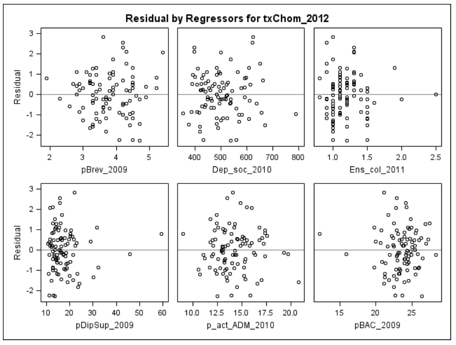

```{r setup, global_options,include=FALSE}
knitr::opts_chunk$set(
  dpi = 200,
  #fig.width = 7,
  #fig.height = 4,
  strip.white = T,
  #dev = "png",
  #dev.args = list(png = list(bg = "transparent")),
  message=FALSE,
  comment=NA,
  echo=FALSE,
  warning=FALSE,
  eval=TRUE
  
)
```

```{r include=FALSE}
source('./assets/functions.R')

# Les librairies
requiredPackages = c('knitr','datasets','kableExtra','ggplot2','gridExtra',
                     'plotly','widgetframe','sn','reshape','dplyr','dotenv',
                     'datarium')
PackageFacile(requiredPackages)

load_dot_env(".env")
annee=Sys.getenv("annee")

sdp <- function(x) sqrt(mean((x-mean(x))^2))

```


```{r data}
#source('./_ISRE2019_data.R')
#load_data()

```


class: center, middle, inverse, title-slide, animated, fadeIn
# Analyse de données L3 `r annee`
# Cours n°5- La régression linéaire et la régression multiple<br /> <br />
### Florian Bayer


<div class="my-footer"><span>Université Paris 1 Panthéon Sorbonne - L3 `r annee` : analyse de données - Florian Bayer</span></div> 

---
class: animated, fadeIn
## Rappels et objectifs du cours
<div class="my-footer"><span>Université Paris 1 Panthéon Sorbonne - L3 `r annee` : analyse de données - Florian Bayer</span></div> 

Lors du précédent cours, nous avons qu'il était possible de mesurer la relation -*linéaire ou non*- entre un deux caractères quantitatifs $x$ et $y$. Cette mesure ce fait à l'aide du coefficient de corrélation R.

--

Il est complémentaire à la **régression linéaire** qui vise à résumer et/ou **modéliser** un phénomène.

--

En géographie, **identifier** puis **modéliser** des **relations** permet de comprendre un phénomène sur un espace donné, de prévoir la survenue de ce phénomène ou encore de déterminer les variables qui manquent à notre explication.

--

Le monde étant complexe, il n'est néanmoins pas rare de devoir expliquer $y$ par plusieurs variables $x_n$ 

L’outil statistique qui permet de modéliser une variable $y$ par plusieurs variables explicatives (on parle de **régresseurs**) est la **régression multiple**. Ce n’est rien d’autre qu’un cas particulier de la régression linéaire simple. 

---
class: inverse, center, middle, animated, fadeIn  
# 1- La régression linéaire


<div class="my-footer-title "></div> 

---
class: animated, fadeIn
## La régression linéaire
<div class="my-footer"><span>Université Paris 1 Panthéon Sorbonne - L3 `r annee` : analyse de données - Florian Bayer</span></div> 

Une fois une **relation linéaire significative** mise en évidence à l'aide de la corrélation, il est possible de **modéliser** la relation via la régression linéaire. 

--

Avec la régression linéaire, on résume le nuage de point par une **droite** dont l'équation sera 


$y = ax + b$


---
class: animated, fadeIn
## La droite de régression de y en fonction de x 
<div class="my-footer"><span>Université Paris 1 Panthéon Sorbonne - L3 `r annee` : analyse de données - Florian Bayer</span></div> 

.pull-left[
La régression linéaire considère que les valeurs $y$ dépendent de celles de $x$, c'est-à-dire que $x$ doit permettre de prévoir $y$. 

On cherche à **minimiser l’erreur de prévision**, c’est-à-dire les résidus entre les $y$ observés (les points) et les $y$ théorique (le modèle, c'est-à-dire la droite). 

Pour cela on projette chaque point parallèlement à l’axe $y$ et on fait en sorte que la somme des distances entre le point et la droite (les traits rouges) soit minime.

C'est écart entre le point et la droite est appelé **résidu** $e$.
]

.pull-right[

.center-img[
$y = ax + b$

```{r echo=FALSE, out.width="100%"}

```
]]

---
class: animated, fadeIn
## Application
<div class="my-footer"><span>Université Paris 1 Panthéon Sorbonne - L3 `r annee` : analyse de données - Florian Bayer</span></div> 

On cherche à déterminer s’il existe une relation entre la température Y et l'altitude X. Pour cela, on enregistre la température dans 8 stations. On calcul d’abord la corrélation :

.pull-left3[
```{r echo=FALSE, out.width="100%"}

i <- seq(1, 8, by=1)
xi<-c(2000,1500,1000,500,1000,1500,2000,2500)
yi<-c(0,3,6,10,8,5,2,-2)

#cor(xi,yi)

xmi <- xi - mean(xi)
ymi <-yi - mean(yi)

z <- xmi*ymi

i<- append(i, c("moyenne", "ect"))
xi<- append(xi, c(mean(xi), sdp (xi)))
yi<- append(yi, c(mean(yi), sdp (yi)))
xmi<- append(xmi, c(mean(xmi), sdp (xmi)))
ymi<- append(ymi, c(mean(ymi), sdp (ymi)))
z<- append(z, c(mean(z), sdp (z)))


df <- data.frame(i,xi, yi,xmi,ymi,z)

df %>%
  dplyr::rename ('xi-moy(x)' = xmi,
                 'yi-moy(y)' = ymi,
                 '[xi-moy(x)] [yi-moy(y)]' = z,
                 
                 ) %>%
  kable(digits = 1)%>%
  kable_styling(font_size = 16,c("bordered"),bootstrap_options = c("striped", "hover"))%>% 
  row_spec(9:10, bold = T) 

```
]

.pull-right1[
- Covariance = -2250 
- écart-type(x) = 612.4
- écart-type(y) = 3.8
- $R = \frac{-2250}{(612,4.3,8)}=-0,97$

On teste R, avec 8 stations météorologiques (6 degrés de liberté)
Le résultat es significatif à moins de 1%
]


---
class: animated, fadeIn
## Application
<div class="my-footer"><span>Université Paris 1 Panthéon Sorbonne - L3 `r annee` : analyse de données - Florian Bayer</span></div> 

.pull-left[.font90[
On trace le nuage de point et on constate que les données s’alignent bien sur une droite de façon monotone. Le signe de la relation est négatif.

L’hypothèse sur le sens de la relation peut être :
- La température dépend de l’altitude (majorité des cas)
- Un alpiniste pourrait toutefois déterminer son altitude en fonction de la température

On postule que la relation la plus probable est la première.  

On cherche à tracer la droite $y^*_i=ax_i+b$ qui minimisera les résidus en $y$
]]

.pull-right[
```{r echo=FALSE, out.width="100%"}

ggplot(df[1:8,], aes(xi, yi)) + geom_point(color='darkred',size = 3) + 
  labs(title="",x="Altitude (m)",y = 'Température (°c)')+
  xlim(500, 2500)+ ylim(-3, 12)+
  expand_limits(x = 0, y = 0) +
  theme(aspect.ratio = 1,text = element_text(size=15))

```
]

---
class: animated, fadeIn
## Estimation de la droite de régression
<div class="my-footer"><span>Université Paris 1 Panthéon Sorbonne - L3 `r annee` : analyse de données - Florian Bayer</span></div> 


Pour estimer la droite qui possède les résidus minimes en $y$, on utilise pour des raisons mathématiques le **critère des moindres carrés** (facilité de calcul). 

En d'autre termes, on souhaite que la **somme des carrés des résidus** en $y$ soit la plus petite possible.

--

Pour calculer les paramètres $a$ (coefficient directeur) et $b$ (ordonnée à l'origine) de cette droite des moindres carrés $y=ax+b$, on utilise les formules suivantes :

- $a= \frac{cov_{x,y}}{\sigma_x²}$ 
soit $a= \frac{-2550}{612²}=-0,006°c/m$
- $b= \bar{y}-(a.\bar{x})$ 
soit $b= 4-(-0.006*1500)=13°c$

--

<br>
L'équation de la droite donne donc: 
.center-img[
$Température (°C) = -0,006 . altitude (m) + 13$
]

---
class: animated, fadeIn
## Interprétation des paramètres
<div class="my-footer"><span>Université Paris 1 Panthéon Sorbonne - L3 `r annee` : analyse de données - Florian Bayer</span></div> 

$a$ est la pente de la droite par rapport aux abscisses : 
- la **variation moyenne** de $y$ lorsque $x$ **augmente de 1**. 
- Il s’agit ici du gradient thermique : tous les 100 mètres, la température baisse de 0,6°C en moyenne.

--

$b$ est l’ordonnée à l’origine de la droite de régression :
- la valeur modélisée (théorique) de $y$ lorsque $x$ vaut 0. 
- Il s’agit ici de la température ramenée au niveau de la mer.

--

Il faut maintenant juger la pertinence, son **adéquation à la réalité**. Un critère de jugement simple est celui faisant appel aux résidus $e$, qui correspondent aux **écarts entre ce que le modèle estime et la réalité**. 

--

Si les écarts sont faibles entre les valeurs observées et estimées, le modèle peut-être jugé pertinent et vice-versa.


---
class: animated, fadeIn
## Qualité de l’ajustement
<div class="my-footer"><span>Université Paris 1 Panthéon Sorbonne - L3 `r annee` : analyse de données - Florian Bayer</span></div> 

.font90[
On peut décomposer l'information totale du modèle pour juger de sa pertinence. $y$ étant la variable à expliquer et $y^*$ la variable modélisée par l'équation de la droite de régression : 
- <span style="color:#FF6B6B"> $Information\:observée\:=$ </span>  <span style="color:#4b8b8b"> $information\:modélisée$ </span>   <span style="color:#FF9F1C">  $+\:information\:résiduelle$ </span> 

Ce qui se traduit mathématiquement par :
- <span style="color:#FF6B6B"> $variance(y)\:=$ </span>  <span style="color:#4b8b8b"> $variance(y^*=ax+b)$ </span> <span style="color:#FF9F1C"> $+\:variance(e)$ </span> 
]

--

.font90[
Cela signifie que plus le modèle <span style="color:#4b8b8b"> $y^*=ax+b$ </span> sera proche de la réalité <span style="color:#FF6B6B"> $y$ </span>, moins la variance des résidus  <span style="color:#FF9F1C"> $e$ </span> sera importante et inversement.
]

--

.font90[
On peut donc facilement calculer un indicateur qui nous informe de la part d'information modélisée par le modèle par rapport à la réalité : **le coefficient de détermination** $r^2$ :
- le ratio entre la variance de $y^*$ et la variance de $y$. si $x$ permet de prédire toutes les valeurs de $y$, la variance de $y*$ serait égale à celle de $y$ et la variance des résidus $e$ sera nulle.
- on peu aussi élever le coefficent de Bravais-Pearson au carré.
]

--

.font90[
$r^2$ varie donc  de 0 à 1 :
- $r^2=0$ : $x$ n'apporte aucun élément de prévision sur $y$ (0%)
- $r^2=1$ : $x$ permet de prévoir toutes les valeurs de $y$ (100%)
]


---
class: animated, fadeIn
## Calcul du r² et des résidus
<div class="my-footer"><span>Université Paris 1 Panthéon Sorbonne - L3 `r annee` : analyse de données - Florian Bayer</span></div> 

.pull-left[
```{r echo=FALSE, out.width="100%"}

i <- seq(1, 8, by=1)
xi<-c(2000,1500,1000,500,1000,1500,2000,2500)
yi<-c(0,3,6,10,8,5,2,-2)

z<- -0.006*xi+13
e<- yi-z


i<- append(i, c("moyenne", "variance"))
xi<- append(xi, c(mean(xi), var (xi)))
yi<- append(yi, c(mean(yi), var (yi)))
z<- append(z, c(mean(z), var (z)))
e<- append(e, c(mean(e), var (e)))

df <- data.frame(i,xi, yi,z,e)

df %>%
  dplyr::rename ('yi* = -0.006xi+13' = z,
                 'e=yi-y*' = e,
                 
                 ) %>%
  kable(digits = 1)%>%
  kable_styling(font_size = 12,c("bordered"),bootstrap_options = c("striped", "hover"))%>% 
  row_spec(9:10, bold = T) 

```
]

.pull-right[
.font80[
On peut calculer $r^2$ de deux façons
- $r^2 = 15,4/16,3 = 0,95$ 
- $r^2 = R^2 = (-0,97)^2 = 0,95$

On constate bien par ailleurs que 
- $variance(y)=variance(y*)+variance(e)$
- $16.3=15.4+0.9$
]]

<br>
.font80[
Connaître l'altitude permet dans l'exemple de **prévoir 95%** des différences de températures entre les stations. 

- **L'information résiduelle**, c’est-à-dire les différences de température non imputables aux différences d'altitude est très faible (les 5% restant).
- L'importance des facteurs autres que l'altitude pouvant générer des différences de températures entre les stations est donc très faible.
- A noter que le $r^2$ se teste avec un F de Fisher-Snedecor, mais les logiciels vous donneront la p-value associée.
]


---
class: inverse, center, middle, animated, fadeIn  
# 2- Les résidus


<div class="my-footer-title "></div> 

---
class: animated, fadeIn
## Les résidus
<div class="my-footer"><span>Université Paris 1 Panthéon Sorbonne - L3 `r annee` : analyse de données - Florian Bayer</span></div> 

.font90[
Les résidus correspondent à l’écart entre les valeurs observées $y_i$ et celles prédites $y_i^*$ par le modèle ou autrement dit. Plus les résidus sont importants, plus l'écart entre l'observé et le modèle est large.]

.pull-left[
```{r echo=FALSE, out.width="80%"}

i <- seq(1, 8, by=1)
xi<-c(2000,1500,1000,500,1000,1500,2000,2500)
yi<-c(0,3,6,10,8,5,2,-2)

z<- -0.006*xi+13
e<- yi-z


i<- append(i, c("moyenne", "variance"))
xi<- append(xi, c(mean(xi), var (xi)))
yi<- append(yi, c(mean(yi), var (yi)))
z<- append(z, c(mean(z), var (z)))
e<- append(e, c(mean(e), var (e)))

df <- data.frame(i,xi, yi,z,e)

df %>%
  dplyr::rename ('yi* = -0.006xi+13' = z,
                 'e=yi-y*' = e,
                 
                 ) %>%
  kable(digits = 1)%>%
  kable_styling(font_size = 11,c("bordered"),bootstrap_options = c("striped", "hover"))%>% 
  row_spec(9:10, bold = T) 

```
]
.pull-right[
```{r echo=FALSE, out.width="80%"}
ggplot(df[1:8,], aes(xi, yi,color=e)) + 
  labs(title="",x="Altitude (m)",y = 'Température (°c)')+
  xlim(500, 2500)+ ylim(-3, 12)+
  expand_limits(x = 0, y = 0) +
  theme(aspect.ratio = 1) +
  geom_smooth(method = "lm", se = FALSE,col="black")+
  geom_text(aes(x = 1800, y =11, label = "y= -0.006x + 13\n r²=0.9474"),col="grey30")+
  scale_colour_gradient2(low = "#4ECDC4", mid = "#FFE66D",
    high = "#FF6B6B", midpoint = 0, space = "Lab",
    na.value = "grey50", guide = "colourbar", aesthetics = "colour")+ 
  geom_point(size =5,shape=20)+
  geom_point(size =4,shape=21,col="black")+theme(text = element_text(size=15))

```
]

.font80[
- Trois stations ont des résidus <span style="color:#FF6B6B">**positifs**</span>, la température étant supérieure de 1° par rapport à la modélisation (**le modèle sous estime la réalité**). 
- Deux stations sont parfaitement modélisées **sans résidus**.
- Trois stations ont des résidus <span style="color:#4ECDC4">**négatifs**</span>, la température étant inférieure de  1° par rapport à la modélisation (**le modèle sur estime la réalité**).
]

---
class: animated, fadeIn
## Interprétation des résidus
<div class="my-footer"><span>Université Paris 1 Panthéon Sorbonne - L3 `r annee` : analyse de données - Florian Bayer</span></div> 
.font90[
L'un des intérêts de la modélisation est de pouvoir **interpréter les écarts au modèle**. Sont-ils liés à des erreurs de mesure ? D'autres facteurs explicatifs ?]

--

.font90[
.pull-left[
Dans l'exemple, c’est l’ensoleillement qui compte. La répartition des résidus n’est pas lié au hasard mais au versant :
- <span style="color:#FF6B6B"> les résidus **positifs** se concentrent sur les versants exposés sur l'adret </span>
- <span style="color:#4ECDC4"> .es résidus **négatifs** se concentrent sur les versants exposés à l'ubac. </span>
- <span style="color:#FF9F1C"> Les résidus **nuls** sont en fond de vallées ou au sommet.</span>

Il serait alors possible d’ajouter une nouvelle variable explicative à notre modèle, comme la quantité d’énergie solaire reçu au m². 
]]

.pull-right[
```{r echo=FALSE, out.width="100%"}


img <- png::readPNG("./assets/images/4-corr/soleil.png")
g <- grid::rasterGrob(img, interpolate=TRUE)

img <- png::readPNG("./assets/images/4-corr/melodie.png")
m <- grid::rasterGrob(img, interpolate=TRUE)


x<-c(0,10,15,25,40,68,75,85,100,110)
y<-c(2500,2000,1500,1000,500,1000,1500,2000,2500,2200)
e <-c(0,-1,-1,-1,0,1,1,1,0,0)
col <-c("red","#4ECDC4","#4ECDC4","#4ECDC4","#FFE66D","#FF6B6B","#FF6B6B","#FF6B6B","#FFE66D","red")

df <- data.frame(x,y,e,col)

ggplot(df, aes(x,y,label=e)) + 
  labs(title="",x=" Sud <------> Nord",y = 'altitude (m)')+
  ylim(0, 2500)+ xlim(0, 110)+
  expand_limits(x = 0, y = 0) +
  theme(aspect.ratio = 1) +
  scale_colour_gradient2(low = "#4ECDC4", mid = "#FFE66D",
    high = "#FF6B6B", midpoint = 0, space = "Lab",
    na.value = "grey50", guide = "colourbar", aesthetics = "colour")+ 
    geom_area(fill="beige",col = "grey50")+
  geom_point(data = df[2:9,],size =5,shape=20,color=df[2:9,]$col)+
  geom_point(data = df[2:9,],size =4,shape=21,col="black")+
  #annotation_custom(g, xmin=10, xmax=30, ymin=2000, ymax=Inf)+
  annotation_custom(m, xmin=70, xmax=110, ymin=0, ymax=1000)+
  geom_text(data = df[2:9,],hjust=-1, vjust=0,color="grey50")


```
]


---
class: animated, fadeIn
## Validation des résidus
<div class="my-footer"><span>Université Paris 1 Panthéon Sorbonne - L3 `r annee` : analyse de données - Florian Bayer</span></div> 

L’interprétation des résidus est un bon moyen de juger un modèle de régression linéaire ou de la régression multiple. Quatre points sont utilisés en statistiques :
- Vérifier que les résidus ont une distribution **normale**.
- Vérifier l’**homoscédasticité** des résidus.
- Vérifier qu’il n’y a pas d’**autocorrélation** des résidus.
- Vérifier la **continuité** de la distribution des résidus (non abordée dans ce cours).

La plupart des outils statistiques comme SAS ou R vous donnent des outils pour vous aider.

---
class: animated, fadeIn
## Normalité des résidus
<div class="my-footer"><span>Université Paris 1 Panthéon Sorbonne - L3 `r annee` : analyse de données - Florian Bayer</span></div> 

.pull-left[.font80[
Comme pour le coefficient de corrélation de Bravais-Pearson, la régression linéaire doit être utilisée sur des distributions de x et y approximativement gaussiennes. 

De plus, il faut que les résidus suivent une loi normale, c'est-à-dire qu'on s'attend à avoir 66% des résidus entre +1 et -1 écart-type ( $\bar{e}=0$ ), 95% entre +2 et -2 écart-type.

Plusieurs outils existent pour vous aider: 
- la mise en évidence d'un interval de confiance à 95% autours de la droite de régression (zone grise sur le graphique)
- l'utilisation de test comme le Shapiro-Wilk’s, qui compare la distribution des résidus à une loi normale: si le test est significatif à 5%, les résidus ne suivent **pas** une loi normale. Dans l'exemple, la p-value =0.02, donc significative à 5%. Les résidus $e$ ne suivent **pas** une loi normale.
- des graphiques de comparaison des distributions (Q-Q plot, densité de noyau)
]]

.pull-right[
.center-img[
```{r echo=FALSE, out.width="80%"}

model <- lm(mpg ~ hp, data = mtcars)
model.diag.metrics <- broom::augment(model)
ggplot(model.diag.metrics, aes(hp, mpg)) +
  geom_point() +
  stat_smooth(method = lm, se = TRUE) 

shapiro.test(model$residuals)

```
]]


---
class: animated, fadeIn
## Normalité des résidus
<div class="my-footer"><span>Université Paris 1 Panthéon Sorbonne - L3 `r annee` : analyse de données - Florian Bayer</span></div> 

Avec les logiciels de statistique, on peut comparer la distribution des résidus à ce qu'ils seraient en s'ils suivaient une loi normale à l'aide des densités de noyaux.
.center-img[
```{r echo=FALSE, out.width="100%"}

```
]

---
class: animated, fadeIn
## Homoscédasticité des résidus
<div class="my-footer"><span>Université Paris 1 Panthéon Sorbonne - L3 `r annee` : analyse de données - Florian Bayer</span></div> 

.pull-left[
Les résidus doivent avoir une variance et une moyenne constante : **homoscédasticité** 

Il arrive fréquemment que les estimations $y^*$ soient très bonnes pour les faibles valeurs de $y$, moins pour les valeurs plus fortes. Le nuage de points des résidus formera alors un **entonnoir** : **hétéroscédasticité**

Une solution possible pour régler le problème est de transformer $x$ et/ou $y$ en logarithme avant de faire la régression.
]

.pull-right[.center-img[
```{r echo=FALSE, out.width="65%"}

data("marketing", package = "datarium")
model <- lm(sales ~ youtube, data = marketing)
model.diag.metrics <- broom::augment(model)
g1<- ggplot(model.diag.metrics, aes(youtube, sales)) +
  geom_point() +
  stat_smooth(method = lm, se = FALSE) 
  #geom_segment(aes(xend = youtube, yend = .fitted), color = "red", size = 0.3)

g1+theme(aspect.ratio = 1,text = element_text(size=15))
```
```{r echo=FALSE, out.width="65%"}

model <- lm(log(sales) ~ log(youtube), data = marketing)
model.diag.metrics <- broom::augment(model)
g2<- ggplot(model.diag.metrics, aes(`log(youtube)`, `log(sales)`)) +
  geom_point() +
  stat_smooth(method = lm, se = FALSE) 
  #geom_segment(aes(xend = youtube, yend = .fitted), color = "red", size = 0.3)

g2+theme(aspect.ratio = 1,text = element_text(size=15))
```
]]

---
class: animated, fadeIn
## Autocorrélations des résidus
<div class="my-footer"><span>Université Paris 1 Panthéon Sorbonne - L3 `r annee` : analyse de données - Florian Bayer</span></div> 

.pull-left[
L’autocorrélation **statistique** des résidus correspond à une corrélation entre les résidus $y-y^*$ et $y$. Cela signifie souvent qu’il y a bien une relation, mais que le modèle linéaire n’est pas adapté. 

Les résidus forment alors une **courbe** qui croise la droite de régression. La transformation des variables $x$ et $y$ permet parfois de régler le problème.

L’autocorrélation **spatiale** des résidus en régression linéaire souligne souvent le fait qu’une variable explicative est manquante.
]

.pull-right[
```{r echo=FALSE, out.width="100%"}
model <- lm(mpg ~ hp, data = mtcars)
model.diag.metrics <- broom::augment(model)
ggplot(model.diag.metrics, aes(hp, mpg)) +
  geom_point() +
  stat_smooth(method = lm, se = FALSE) 
```
]

---
class: animated, fadeIn
## Transformation des données
<div class="my-footer"><span>Université Paris 1 Panthéon Sorbonne - L3 `r annee` : analyse de données - Florian Bayer</span></div> 

.font90[
En régression, il est parfois nécessaire de **transformer** les variables pour avoir un meilleur ajustement. Par exemple lorsque le nuage de points n’est pas modélisé par une droite, mais par une courbe.
En transformant les variables $x$ et/ou $y$, on cherchera à rendre le nuage de points « droit ». En contrepartie, **l’interprétation devient plus complexe** (log de la densité?).]

.center-img[
```{r echo=FALSE, out.width="70%"}

```
]


---
class: inverse, center, middle, animated, fadeIn  
# 2- La régression multiple


<div class="my-footer-title "></div> 

---
class: animated, fadeIn
## Similitudes
<div class="my-footer"><span>Université Paris 1 Panthéon Sorbonne - L3 `r annee` : analyse de données - Florian Bayer</span></div> 

La régression linéaire simple et la régression multiples reposent sur les **mêmes principes** et répondent aux mêmes **objectifs** (résumer, modéliser, prévoir).
- La régression multiple fait appel au coefficient de corrélation linéaire.
- On cherche l'équation qui résume au mieux $y$ en fonction des régresseurs (critère des moindres carrées).
- On juge de la qualité de la modélisation à l'aide du coefficient de **détermination multiple**.
- On observe les **résidus**, qui peuvent être cartographiés.

Le contrôle des résidus se fait de la même manière que pour la régression linéaire (normalité, homoscédasticité, autocorrélation, discontinuité).

---
class: animated, fadeIn
## Différences
<div class="my-footer"><span>Université Paris 1 Panthéon Sorbonne - L3 `r annee` : analyse de données - Florian Bayer</span></div> 

.pull-left[
Il existe toutefois quelques différences importantes :
- Avec 2 régresseurs, la représentation graphique devient complexe (en trois dimensions). Au delà, elle se fait à $n$ dimensions (hyperplan).
- Les variables explicatives apportent une partie de l'information pour modéliser $y$. La principale difficulté de la régression multiple est de choisir des variables qui ne soient **pas redondantes** (qui n'apportent pas plusieurs fois la même information pour expliquer $y$).
- Le calcul manuel devient complexe au-delà de 2 régresseurs et doit faire appel à des calculs matriciels.
]

.center-img[.pull-right[
```{r echo=FALSE, out.width="80%"}
knitr::include_graphics("./assets/images/5-multiple/dim.gif")
```

```{r echo=FALSE, out.width="80%"}

```

]]


---
class: animated, fadeIn
## Equation
<div class="my-footer"><span>Université Paris 1 Panthéon Sorbonne - L3 `r annee` : analyse de données - Florian Bayer</span></div> 

Pour la régression linéaire simple, la droite d'équation de $y$ en fonction de $x$ est : $y=ax+b$

La régression multiple consiste à ajouter des variables explicatives $x_i$ à l'équation, afin de mieux modéliser $y$. On ne parle donc plus de droite mais **d’équation de régression** qui s'écrira:
$y=a_1x_1 + a_2x_2 + a_ix_i +...+ b$ 

- $x_i$ correspondant aux différentes variables explicatives
- $a_i$ les paramètres et le signe de $x_i$ 
- $b$ la part non expliquée par le modèle (l’erreur commise par le modèle pour chaque valeur de $y$)

Comme pour la régression linéaire, l’information se décompose de la manière suivante:
- <span style="color:#FF6B6B"> $Information\:observée\:=$ </span>  <span style="color:#4b8b8b"> $information\:modélisée$ </span>   <span style="color:#FF9F1C">  $+\:information\:résiduelle$ </span> 

Ce qui se traduit mathématiquement par :
- <span style="color:#FF6B6B"> $variance(y)\:=$ </span>  <span style="color:#4b8b8b"> $variance(y^*=a_ix_i+b)$ </span> <span style="color:#FF9F1C"> $+\:variance(e)$ </span> 


---
class: animated, fadeIn
## Colinéarité 
<div class="my-footer"><span>Université Paris 1 Panthéon Sorbonne - L3 `r annee` : analyse de données - Florian Bayer</span></div> 

La **principale difficulté** de la régression multiple réside dans le fait que les régresseurs peuvent **interagir entre eux** et apporter la  <span style="color:darkred"> **même information au modèle**  </span>  : la **colinéarité**

.center-img[
```{r echo=FALSE, out.width="100%"}

```
]

Si vous ajouter toutes les variables à votre disposition, l’**interprétation** n’en sera que plus **difficile** et vous ne pourrez probablement **pas valider** le modèle.

Une forte colinéarité peut même aboutir au changement de signe de la relation d’une variable dans le modèle multiple par rapport au modèle linéaire simple… Des indicateurs statistiques existent pour vous aider et ils seront abordés dans ce cours.

---
class: animated, fadeIn
## Comment définir un modèle ? 
<div class="my-footer"><span>Université Paris 1 Panthéon Sorbonne - L3 `r annee` : analyse de données - Florian Bayer</span></div> 

Il existe plusieurs méthodes statistiques qui permettent de contourner les principales difficultés de la régression multiple : 
- Utilisation du $r^2$ **ajusté** à la place du $r^2$.
- Mesure de la **significativité** des paramètres des régresseurs.
- Mesure de la **colinéarité.**
- Outils pour **comparer les modèles entre eux**.

La plupart des logiciels de statistiques comme XLSTAT, SAS ou R proposent ces outils. Vous pouvez même réaliser la régresion sous Excel à l’aide de l’utilitaire d’analyse, mais les outils seront plus limités.

---
class: animated, fadeIn
## $r^2$ ajusté 
<div class="my-footer"><span>Université Paris 1 Panthéon Sorbonne - L3 `r annee` : analyse de données - Florian Bayer</span></div> 

Les logiciels donnent souvent deux coefficients de détermination **multiples**:
- Un premier non ajusté (le même que pour la régression linéaire simple)
- Un second ajusté : $r^2$ **ajusté**

C’est ce dernier qui nous intéresse, car il prend en compte le nombre de variables alors que le $r^2$ classique augmentera mathématiquement en fonction du nombre de régresseurs. En raison de son mode de calcul, il peut parfois être négatif (rare).

Le $r^2$ **ajusté** s’interprète comme le $r^2$  et permet de **comparer des modèles entre eux** : on préfère généralement un modèle qui explique mieux la variance de $y$ qu'un second, qui l'explique moins bien...

---
class: animated, fadeIn
## Test des paramètres des régresseurs
<div class="my-footer"><span>Université Paris 1 Panthéon Sorbonne - L3 `r annee` : analyse de données - Florian Bayer</span></div> 

Les paramètres du régresseur correspondent aux coefficients $a_i$ de l'équation de régression :

$y=a_1x_1 + a_2x_2 + a_ix_i +...+ b$

Comme pour la régression linéaire, ils correspondent à la **variation moyenne** de $y$ lorsque $a_i$ **augmente de 1** et que les autres coefficients sont constants.

Tous les logiciels de statistiques testent la robustesse des coefficients $a_i$ à l’aide d’une statistique $t$ de **Student** et de sa probabilité $t-value$. Elle s'interprète comme une $p-value$.

Prenez de préférence les valeurs de $t-value <0,05$. Cette statistique est essentielle car elle permet de définir manuellement un modèle et de le **valider**

---
class: animated, fadeIn
## Mesure de la colinéarité
<div class="my-footer"><span>Université Paris 1 Panthéon Sorbonne - L3 `r annee` : analyse de données - Florian Bayer</span></div> 

Pour mesurer la **redondance** entre les variables explicatives, on utilise la statistique **VIF** (Variance Inflation Factor) :
- Il y a une VIF par variable explicative. On prend toujours la **VIF maximum** de **l’ensemble des régresseurs** pour mesurer la colinéarité.
- Plus la VIF est **petite**, moins la colinéarité est importante.

Dans certain cas, enlever une variable corrélée aux autres **fait drastiquement baisser les autres VIF**

Il n’y a pas vraiment de consensus sur la valeur limite VIF à prendre en compte (inférieure à 3 ou à 10?). On cherchera pour ce cours des **VIF inférieures à 7.** Précisez le dans la méthodologie de votre étude.

Il n’y a pas de formule prédéfinie pour calculer le VIF sous Excel, mais elle est disponible dans tous les logiciels de statistiques.


---
class: inverse, center, middle, animated, fadeIn  
# 4- Choisir un modèle


<div class="my-footer-title "></div> 

---
class: animated, fadeIn
## Sélection d’un modèle
<div class="my-footer"><span>Université Paris 1 Panthéon Sorbonne - L3 `r annee` : analyse de données - Florian Bayer</span></div> 

.pull-left3[


Généralement, plusieurs modèles de régression vous serons proposés dans les logiciels de statistique.  Si vous devez choisir entre plusieurs modèles, la sélection peut se faire sur :

- le $r^2$ ajusté
- la facilité d'interprétation du modèle (il est préférable d'avoir un modèle moins bon que l'on peut expliquer plutôt qu'un modèle excellent que l'on ne peut interpréter)
- l’**AIC** : *Akaike Information Criterion* : plus l’AIC est petit, moins le modèle est complexe par rapport à ce qu'il explique (parcimonie). On choisit donc les AIC les plus faibles.

La régression est donc un processus itératif : 
- on lance la regression
- on analyse les résultats
- on corrige / adapte le modèle
- on relance la régression
]

.pull-right1[
.center-img[
```{r echo=FALSE, out.width="100%"}
knitr::include_graphics("./assets/images/5-multiple/Akaike.jpg")
```
]]


---
class: animated, fadeIn
## Sélection d’un modèle
<div class="my-footer"><span>Université Paris 1 Panthéon Sorbonne - L3 `r annee` : analyse de données - Florian Bayer</span></div> 

On cherche à faire augmenter r², mais pas trop le nombre de variables dans le modèle

Vous pouvez choisir un des modèles avec l’aide des paramètres suivants :
- Prendre les meilleurs r² ajustés 
- Recherche des 5 à 10 meilleurs modèles selon l’AIC (les plus petits)
- Vérification de la significativité de tous les paramètres avec la t-value
- Vérifier l’adéquation des signes de vos paramètres avec votre hypothèse : le taux de chômage ne varie pas dans le même sens que le niveau d’éducation.
- Vérification des VIF <7

Le plus important en science sociale n’est pas d’avoir un modèle très proche de la réalité avec 30 variables explicatives. La force de la régression est sa capacité de **modélisation synthétique de la réalité** (d’où l’utilisation d’une droite de régression et non pas de polynômes complexes).

Il faut donc contextualiser le modèle par rapport à la problématique et faire un **compromis** entre adéquation à la réalité et simplicité d’interprétation.


---
class: animated, fadeIn
## Validation
<div class="my-footer"><span>Université Paris 1 Panthéon Sorbonne - L3 `r annee` : analyse de données - Florian Bayer</span></div> 

Outre la validation **statistiques** de vos modèles, n’oubliez pas de **confronter** vos résultats avec votre hypothèse et de répondre à votre problématique.
- Vérifiez le **r² ajusté** de votre modèle
- Vérifiez la significativité de vos régresseurs à l’aide de la **t-value**
- Vérifiez le **signe** de vos régresseurs par rapport à vos hypothèses
- Vérifiez la colinéarité à l’aide de la **VIF**
- Si vous comparez plusieurs modèles, utilisez l’**AIC** ou au moins le r² ajusté
- Comme pour la régression linéaire, validez les résidus du modèle (normalité, homoscédasticité, absence d'autocorrélation)


---
class: animated, fadeIn
## Risques
<div class="my-footer"><span>Université Paris 1 Panthéon Sorbonne - L3 `r annee` : analyse de données - Florian Bayer</span></div> 

Faible pouvoir explicatif du modèle si $y$ est peu lié aux $xi$
- evalué par le r² multiple

Fortes corrélations entre les variabes $xi$
- multicolinéarité
- evalué par la VIF

Trop de variables explicatives
- surajustement, modèle difficilement interprétable
- evalué par l'AIC


---
class: inverse, center, middle, animated, fadeIn  
# 5- Réalisation


<div class="my-footer-title "></div> 

---
class: animated, fadeIn
## Approches techniques
<div class="my-footer"><span>Université Paris 1 Panthéon Sorbonne - L3 `r annee` : analyse de données - Florian Bayer</span></div> 

Plusieurs approches sont possibles pour réaliser techniquement une régression multiple : 

1/ Ajouter manuellement dans le modèle les variables qui vous apparaissent pertinentes suite à vos recherches.
- Vous pourrez plus facilement interpréter ce modèle et la causalité.
- Mais ce modèle ne sera sans doute pas le meilleur.
- Avec un fort risque d'avoir de la colinéarité et des régresseurs non significatifs dans le modèle.

2/ Méthode pas-à-pas. 
- Vous réalisez une régression multiple avec toutes les variables qui vous semble pertinentes, puis vous éliminer une à une les variables non significative. 
- Par exemple en elevant d'abord le régresseur avec la t-value la moins significative, puis en faisant retourner le modèle sans cette variable. Vous poursuivez cette méthode jusqu'à avoir un modèle acceptable (signficatif, sans colinéarité).
- Ce ne sera pas forcément le meilleur modèle, mais l'approche à le mérite d'être reproductible.

---
class: animated, fadeIn
## Approches techniques
<div class="my-footer"><span>Université Paris 1 Panthéon Sorbonne - L3 `r annee` : analyse de données - Florian Bayer</span></div> 

3/ Méthode semi-assisté .
- Le logiciel de statistique vous propose automatiquement les meilleurs modèles en fonction d’un critère comme l’AIC ou le r² ajusté.
- Avec le risque d'avoir de ne pas comprendre les éventuelles causalité du modèle choisi

C'est généralement la 3ème approche qui est choisie en statistique. Pour des raisons pratiques, c'est cette dernière qui sera abordée dans l'exemple suivant et que vous metterez en application.

---
class: animated, fadeIn
## Exemple: modélisation du taux de chômage
<div class="my-footer"><span>Université Paris 1 Panthéon Sorbonne - L3 `r annee` : analyse de données - Florian Bayer</span></div> 

On cherche à modéliser des déterminants socio-démographiques du taux de chômage par département en 2012. La régression multiple est donc un outil adéquat pour répondre à cette problématique.

.center-img[
```{r echo=FALSE, out.width="80%"}

```
]

---
class: animated, fadeIn
## Analyse univariée
<div class="my-footer"><span>Université Paris 1 Panthéon Sorbonne - L3 `r annee` : analyse de données - Florian Bayer</span></div> 

On réalise une analyse univariée afin de mieux comprendre nos variables explicatives (succintes dans l'exemple pour des questions de temps...). Permet par exemple de transformer les variables.

.center-img[
```{r echo=FALSE, out.width="100%"}

```
]

---
class: animated, fadeIn
## Analyse bivariée
<div class="my-footer"><span>Université Paris 1 Panthéon Sorbonne - L3 `r annee` : analyse de données - Florian Bayer</span></div> 

.pull-left[
.center-img[
```{r echo=FALSE, out.width="100%"}

```
]]

.pull-right[
.center-img[
```{r echo=FALSE, out.width="100%"}

```
]]

Suppression des variables $xi$ très corrélées entre elles (une seule conservée, par exemple lorsque p-value <0.3)


---
class: animated, fadeIn
## Analyse bivariée
<div class="my-footer"><span>Université Paris 1 Panthéon Sorbonne - L3 `r annee` : analyse de données - Florian Bayer</span></div> 

.pull-left[

On réalise la régression linéaire entre le taux de chômage et le % des 25-34 ans avec au maximum le brevet (sur la population des 25-34 ans) (R= 0,59 et significatif)

.center-img[
```{r echo=FALSE, out.width="100%"}

```
]]

.pull-right[
.center-img[
```{r echo=FALSE, out.width="80%"}

```
]]


---
class: animated, fadeIn
## Régression multiple
<div class="my-footer"><span>Université Paris 1 Panthéon Sorbonne - L3 `r annee` : analyse de données - Florian Bayer</span></div> 

Les logiciels de statistiques comme SAS et R permettent de déterminer le modèle le plus pertinent pour chaque nombre de régresseurs. L'affichage de ces modèles est fait en fonction d'un critère que vous choissisez (AIC, r² ajusté)

.center-img[
```{r echo=FALSE, out.width="100%"}

```
]


---
class: animated, fadeIn
## Régression multiple
<div class="my-footer"><span>Université Paris 1 Panthéon Sorbonne - L3 `r annee` : analyse de données - Florian Bayer</span></div> 

.pull-left3[
- On constate qu’en ajoutant une variable au modèle linéaire à une variable, la quantité d’information portée par le modèle passe de 36% à 49% (pBrev_2009 + Dep_soc_2010).
- 59% avec seulement 3 variables (pBrev_2009 + Dep_soc_2010 + Ens_col_2011). 
- L’ajout d’une quatrième variable (p_act_ADM_2010) n’apporte que 4% d’information supplémentaire. Au-delà de 7 variables, l’information supplémentaire est négligeable et stagne.

Etant donné son AIC faible (23,2 vs 28,7 pour le meilleur modèle a 5 variables) et un bon coefficient de détermination, on décide d’analyser le modèle à 6 variables. Le modèle à 7 variables ayant bien le plus faible AIC (22,7), mais le nombre de régresseurs commence à être trop important

]

.pull-right1[
.center-img[
```{r echo=FALSE, out.width="50%"}

```
]]

---
class: animated, fadeIn
## Résultats à 6 variables
<div class="my-footer"><span>Université Paris 1 Panthéon Sorbonne - L3 `r annee` : analyse de données - Florian Bayer</span></div> 

On relance cette fois ci la régression linéaire avec les 6 régresseurs, sans demander au logiciel de statistique de nous donner la liste des meilleurs modèles.

.center-img[
```{r echo=FALSE, out.width="80%"}

```
```{r echo=FALSE, out.width="70%"}

```
]
.font90[Tous les paramètres <span style="color:orange"> t </span> sont significatifs et la <span style="color:red">VIF max</span> est inférieure à 7 (5,01)]

---
class: animated, fadeIn
## Analyse des résidus
<div class="my-footer"><span>Université Paris 1 Panthéon Sorbonne - L3 `r annee` : analyse de données - Florian Bayer</span></div> 

.pull-left[
L'analyse des résidus d'une régression multiple se fait en deux étapes : l'analyse des résidus du modèle puis de chaque régresseur

Dans l'exemple on constate une très légère hétéroscédasticité **des résidus du modèle** avec une moins bonne adéquation pour les fortes valeurs (graphique en haut à gauche)	

Comme l’analyse bivariée l’a montré, certaines valeurs ne s’ajustent pas de manière optimale sur une droite mais plutôt sur une courbe.

Le passage en logarithme de certaines variables seraient donc une solution, mais au prix de la complexification du modèle.

]

.pull-right[
.center-img[
```{r echo=FALSE, out.width="100%"}

```
]]

---
class: animated, fadeIn
## Analyse des résidus
<div class="my-footer"><span>Université Paris 1 Panthéon Sorbonne - L3 `r annee` : analyse de données - Florian Bayer</span></div> 

.pull-left[
L'analyse des résidus de chaque régresseur montre que la part des 25-34 ans avec un diplôme supérieur serait un candidat à la transformation en logarithme.

On note aussi que le nombre de collège pour 10 000 hab. se comporte comme une variable discrète. Ceci est lié à l'arrondi de cette valeur dans le tableau de données.
]

.pull-right[
.center-img[
```{r echo=FALSE, out.width="100%"}

```
]]

---
class: inverse, center, middle, animated, fadeIn  
# 6- Cartographie des résidus


<div class="my-footer-title "></div> 

---
class: animated, fadeIn
## Cartographie des résidus
<div class="my-footer"><span>Université Paris 1 Panthéon Sorbonne - L3 `r annee` : analyse de données - Florian Bayer</span></div> 

**La cartographie des résidus** permet de **localiser** les individus bien représentés par le modèle, ainsi que ceux qui s’en écartent.  
Le calcul des résidus peut être fait manuellement, mais des outils comme Philcarto permettent d’obtenir directement les valeurs des résidus dans le cas d'une regression linéaire simple. (cf. Guide Philcarto.pdf et TD).

Le calcul manuel des résidus est relativement simple :
- il suffit de connaitre l’équation de la droite de régression $y^*=ax+b$
- de remplacer $x$ par la valeur $x_i$ associée (l’altitude à un point de mesure par exemple).
- On obtient alors la valeur de $y_i^*$, la température estimée par le modèle à une altitude $xi$. 
- Il ne reste plus qu'à faire l'opération : observé - estimé $e=y-y^*$

---
class: animated, fadeIn
## Cartographie des résidus
<div class="my-footer"><span>Université Paris 1 Panthéon Sorbonne - L3 `r annee` : analyse de données - Florian Bayer</span></div> 

.font80[
La plupart du temps, la représentation des résidus se fait à l’aide de la variable visuelle valeur + couleur (ou texture), sous la forme d’une double gamme inversée:
- Résidus négatifs (le modèle surestime l’observé)
- Résidus proches du modèle (le modèle est conforme à l’observé)
- Résidus positifs (le modèle sous-estime l’observé)

Comme les résidus doivent avoir une distribution normale autours de la droite, on applique **une discrétisation en moyenne écart-type** pour les cartographier. Philcarto propose la discrétisation suivante par défaut:
]
.center-img[
```{r echo=FALSE, out.width="80%"}
knitr::include_graphics("./assets/images/4-corr/carto_ect.png")
```
]

---
class: animated, fadeIn
## Cartographie des résidus
<div class="my-footer"><span>Université Paris 1 Panthéon Sorbonne - L3 `r annee` : analyse de données - Florian Bayer</span></div> 

.font80[
La mise en page d’une carte des résidus suit les mêmes principes que les autres cartes. Il faut cependant guider un maximum le lecteur, en lui donnant des informations techniques (la valeur des résidus), mais également une aide à l’interprétation 

.center-img[
```{r echo=FALSE, out.width="70%"}

```
]

]


---
class: animated, fadeIn
## Cartographie de l’évolution de l’écart au modèle
<div class="my-footer"><span>Université Paris 1 Panthéon Sorbonne - L3 `r annee` : analyse de données - Florian Bayer</span></div> 

La cartographie des résidus permet de repérer les individus qui s’ajustent le moins bien au modèle. Les cartes ci-dessous montrent l’écart au modèle en fonction du nombre de régresseurs.


.center-img[
```{r echo=FALSE, out.width="100%"}

```
]

---
class: inverse, center, middle, animated, fadeIn  
# Conclusions


<div class="my-footer-title "></div> 

---
class: animated, fadeIn
## Concepts clés
<div class="my-footer"><span>Université Paris 1 Panthéon Sorbonne - L3 `r annee` : analyse de données - Florian Bayer</span></div> 

La régression permet de modéliser une variable $y$ à expliquer par des variables explicatives $xi$ .

La régression multiple **diffère peu** de la régression linéaire simple. Elle nécessite toutefois une **grande rigueur** a cause de la colinéarité. Bien utilisée, elle reste un outil puissant de modélisation, de prévision et d’explication. Elle peut également être très utile dans une démarche exploratoire.

Pour mener a bien votre étude, pensez :
- A bien définir votre problématique.
- En émettant des hypothèses sur les relations de $y$ avec les régresseurs.
- A exclure certaines variables fortement corrélées entre elles (gardez soit le PIB ou le PNB, mais pas les deux).
- A utiliser les valeurs **AIC, VIF et r² ajusté** pour vous aider dans le choix du modèle final. 

---
class: animated, fadeIn
## Concepts clés
<div class="my-footer"><span>Université Paris 1 Panthéon Sorbonne - L3 `r annee` : analyse de données - Florian Bayer</span></div> 

Attention vous n’êtes pas prisonniers des statistiques (dans une moindre mesure). Même si d’un point de vue statistique l’utilisation du critère AIC ou r² ajusté permettent de garantir les meilleurs modèles, il faut parfois prendre du recul et privilégier **l’interprétation des résultats**:
- Si un modèle a un critère AIC plus grand de 2 points qu’un second modèle très complexe à interpréter mais avec le même nombre de régresseurs, il faut parfois privilégier le premier (en fonction de votre problématique)
- Selon la problématique et plus généralement en science sociale, préférez un modèle à 4 variable expliquant 75 % de la variance de $y$ mais plus simple à expliquer, qu’un modèle expliquant 85% de $y$ mais avec 15 variables.

Si la régression multiple peut-être utilisée comme un outil de démarche exploratoire pour expliquer un phénomène, nous verrons dans les prochains cours une méthode également basée sur le **résumé** d’un nuage de points : les analyses factorielles 

