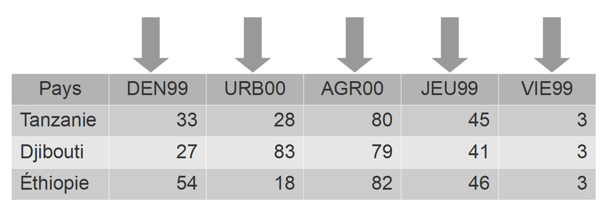
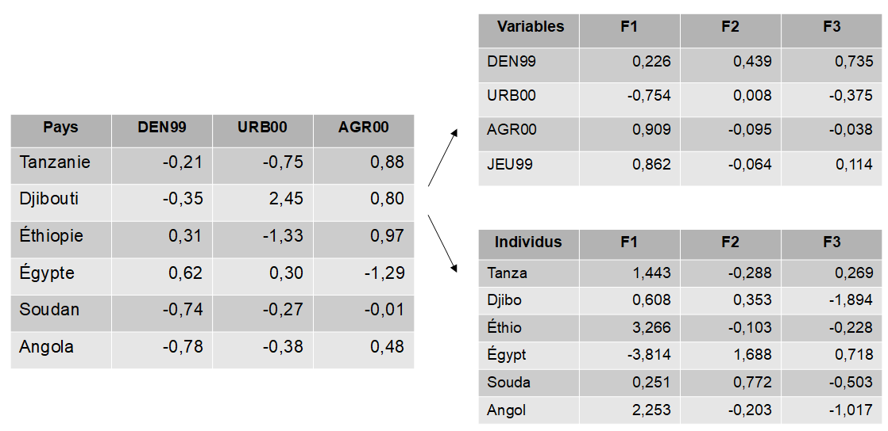
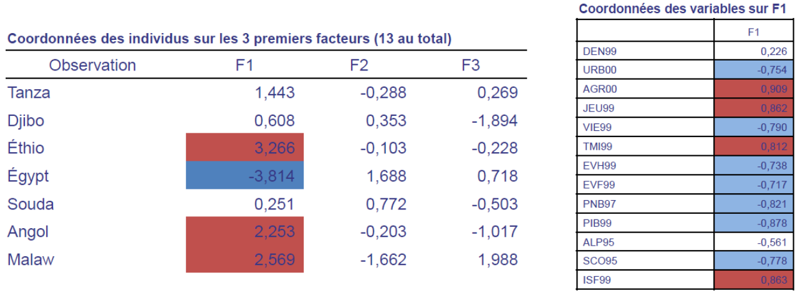
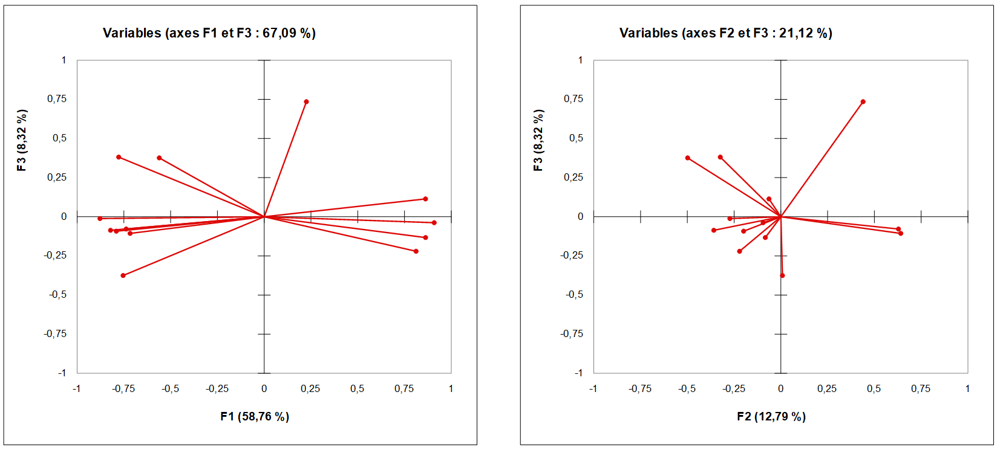

```{r setup, global_options,include=FALSE}
knitr::opts_chunk$set(
  dpi = 200,
  #fig.width = 7,
  #fig.height = 4,
  strip.white = T,
  #dev = "png",
  #dev.args = list(png = list(bg = "transparent")),
  message=FALSE,
  comment=NA,
  echo=FALSE,
  warning=FALSE,
  eval=TRUE
  
)
```

```{r include=FALSE}
source('./assets/functions.R')

# Les librairies (attention, assez les installations sont longues pour ce cours)
requiredPackages = c('knitr','datasets','kableExtra','ggplot2','gridExtra',
                     'RColorBrewer','FactoMineR', 'factoextra','rgdal','spdplyr',
                     'plotly','widgetframe','sn','reshape','dplyr','tidyverse',
                     'dotenv'
)

PackageFacile(requiredPackages)

load_dot_env(".env")
annee=Sys.getenv("annee")

sdp <- function(x) sqrt(mean((x-mean(x))^2))

```


```{r data}
#source('./_ISRE2019_data.R')
#load_data()

```


class: center, middle, inverse, title-slide, animated, fadeIn
# Analyse de données L3 `r annee`
# Cours n°6- L’analyse en composante principale<br /> <br />
### Florian Bayer


<div class="my-footer"><span>Université Paris 1 Panthéon Sorbonne - L3 `r annee` : analyse de données - Florian Bayer</span></div> 

---
class: animated, fadeIn
## Rappels et objectifs du cours
<div class="my-footer"><span>Université Paris 1 Panthéon Sorbonne - L3 `r annee` : analyse de données - Florian Bayer</span></div> 

Les outils statistiques permettent d’analyser et de simplifier de manière pertinente d’importantes masses de données :

--

- L’analyse univariées pour **résumer** efficacement un tableau élémentaire de données.
- La cartographie, qui informe sur **l’organisation spatiale** de ces données.
- L’analyse bivariée et la régression multiple pour **mesurer modéliser et expliquer l'association** entre des variables. Elles sous entendent néanmoins de poser des hypothèses fortes sur le sens de la relation et ne permettent pas toujours d’appréhender la **complexité des relations** (colinéarité en régression multiple).

--

Il existe des outils permettant de **décorréler**,  **réorganiser** et **hiérarchiser** l’information : **les analyses factorielles**. En contrepartie, il s’agit uniquement de méthodes **descriptives** et non plus explicatives.

---
class: animated, fadeIn
## L'information statistique
<div class="my-footer"><span>Université Paris 1 Panthéon Sorbonne - L3 `r annee` : analyse de données - Florian Bayer</span></div> 

Lors de ce cours, le terme **information** va être régulièrement utilisé. Il s'agit ici des informations statistiques contenues dans votre tableau de données, au sens large : 

--

- Les phénomènes (réels) qui sont contenus dans vos données
- et plus particulièrement dans les interrelations entre vos données (votes FN et défaveur sociale, espaces urbains vs ruraux, richesse dans les grandes villes etc.)

--

Ces informations sont très souvent redondantes entre les variables (colinéaires) et posent des problèmes d'interprétations. L'idée de l'analyse factorielle est de rendre chaque *information* indépendante de l'autre. 

--

Reste alors à **comprendre** à quoi correspond concrêtement cette information.

--

A noter que l'*information* peut-être mesurée à l'aide de la variance.

---
class: animated, fadeIn
## Applications
<div class="my-footer"><span>Université Paris 1 Panthéon Sorbonne - L3 `r annee` : analyse de données - Florian Bayer</span></div> 

Les analyses factorielles permettent de **recombiner** les variables d'un tableau en **nouveaux indicateurs** appelés facteurs. Ils peuvent servir à résumer ou à mieux comprendre des informations complexes souvent colinéaires 

.center-img[
```{r echo=FALSE, out.width="100%"}

```
]

---
class: animated, fadeIn
## Principes
<div class="my-footer"><span>Université Paris 1 Panthéon Sorbonne - L3 `r annee` : analyse de données - Florian Bayer</span></div> 

Jusqu'ici, vous pouviez analyser les relations entre les variables, mais uniquement deux à deux à l'aide de l'analyse bivariée. Mais cela ne permet pas de synthétiser un phénomène plus complexe, un tableau de données avec de nombreux caractères.

--

L’analyse factorielle permet ceci en **combinant les variables**. Elle n’est que le passage de l'ajustement linéaire entre deux variables à une ajustement entre plusieurs variables :
- On analyse **toutes les variables** du tableau de données en même temps.
- On souhaite déterminer comment varient **simultanément** toutes les variables.
- En prenant **tous les caractères de tous les individus**.

--

Pour cela on cherche à **résumer** à l'aide de **droites** l'information de notre nuage de points (à n dimensions).

---
class: inverse, center, middle, animated, fadeIn  
# 1- Principes


<div class="my-footer-title "></div> 

---
class: animated, fadeIn
## Principes de l’ACP
<div class="my-footer"><span>Université Paris 1 Panthéon Sorbonne - L3 `r annee` : analyse de données - Florian Bayer</span></div> 

**L’analyse en composante principale (ACP)** utilise  les corrélations entre les variables **quantitatives**, non plus pour expliquer mais pour **décrire et résumer** l'information contenue par l’**ensemble** de ces variables.

--

Son but est de **transformer** des variables redondantes (cf. colinéarité de la régression multiple) entre elles en **nouvelles variables indépendantes** les unes des autres (décoréllées).

--

On appellera les nouvelles variables créées par l’ACP des **facteurs, axes ou composantes principales**.

--

Ces facteurs sont autant de **nouvelles variables synthétiques et décoréllées**, construites à partir du tableau initiale de données.

---
class: animated, fadeIn
## Principes de l’ACP
<div class="my-footer"><span>Université Paris 1 Panthéon Sorbonne - L3 `r annee` : analyse de données - Florian Bayer</span></div> 

Les analyses factorielles peuvent être abordées de deux manières:

--

- une première basée sur la **statistique** : reconfiguration des données initiales en axes indépendants, décoréllées et expliquant au mieux la variance des données.
- Une seconde basée sur la **géométrie** : représentation des variables dans un nouvel plan géométrique, puisque l’on recompose les données de manière optimale, selon des axes d’inertie maximale (facteurs).


---
class: animated, fadeIn
## Contexte
<div class="my-footer"><span>Université Paris 1 Panthéon Sorbonne - L3 `r annee` : analyse de données - Florian Bayer</span></div> 

Avec les analyses factorielles, on cherche à **résumer** au mieux le nuage de points à l'aide de droites du type<span style="color:#619cff"> $ax+by+c=0$ </span>. Elles sont différentes de la droite<span style="color:#f8766d"> $y=ax+b$ </span>utilisée en régression et qui minimise les résidus en $y$ (ou <span style="color:#00ba38"> $x=ay+b$ </span>qui minimise en $x$)

```{r echo=FALSE}
set.seed(1983) 
# 
x <- rnorm(50,mean=100,sd=20)
# y = 0.8 * x + noise
y <- 0.8 * x + rnorm(50,mean=0,sd=10)

#combine x and y into a single data frame for easy use:
data <- data.frame(x,y)


#fit the model
line1 <- lm(y~x)$coef
#extract the slope from the fitted model
line1.slope <- line1[2]
#extract the intercept from the fitted model
line1.intercept <- line1[1]

#model x using y (what if x is actually predicted by y)
line2 <- lm(x~y)$coef
#y = mx + c
#(y-c) = mx
#x = (1/m)y - (c/m)
line2.slope <- (1/line2[2])
line2.intercept <- -(line2[1]/line2[2])


#A function to standardise a variable:
stdize <- function(x){(x-mean(x))/sd(x)}

#build a data frame from vectors x and y:
stdData <- data.frame(x,y)
#calculate the standardised value of each variable, and the mean/sd:
stdData %>% 
  mutate_all(funs(stdize,mean,sd)) -> stdData

#calculate the regression line using standardised variables:
stdlm <- lm(y_stdize ~ x_stdize, data=stdData)

#extract the coefficients:
stdData$slope <- coef(stdlm)[2]
stdData$intercept <- coef(stdlm)[1]
#calculate predicted values of y using the regression line:
stdData$y_hat <- (stdData$x_stdize * stdData$slope) + stdData$intercept

pca <- prcomp(cbind(x,y))$rotation
pca.slope <- pca[2,1] / pca[1,1]
pca.intercept <- mean(y) - (pca.slope * mean(x))


#calculate where each point would be on each line of best fit, if it was on it
#these datapoints are labelled "xhat_", "yhat_"
#ultimately want a "long" dataset which has a column specifying which line a variable corresponds to
data %>%
  #calculate the positions using the line equations:
  mutate(yhat_line1=(x*line1.slope+line1.intercept),
         xhat_line1=x,
         yhat_line2=y,
         xhat_line2=(y-line2.intercept)/line2.slope,
         a=pca.slope,
         b=-1,
         c=pca.intercept,
         xhat_line3=(b*(b*x-a*y)-(a*c))/((a*a)+(b*b)),
         yhat_line3=(a*(-b*x+a*y)-(b*c))/((a*a)+(b*b)),
         #add the slopes/intercepts to this data frame:
         slope_line1=line1.slope,
         slope_line2=line2.slope,
         slope_line3=pca.slope,
         intercept_line1=line1.intercept,
         intercept_line2=line2.intercept,
         intercept_line3=pca.intercept
  )%>% 
  #drop intermediate variables
  select(-c(a,b,c)) %>%
  #transpose to a long form
  gather(key="key",value="value",-c(x,y)) %>% 
  # have "yhat_line1", want two colums of "yhat" "line1"
  separate(key,c("type","line"),"_") %>% 
  #then transpose to be fatter, so we have cols for xhat, yhat etc
  spread(key="type",value="value") %>%
  #relable the lines with more description names, and order the factor for plotting:
  mutate(line=case_when(
    line=="line1" ~ "y=ax+b",
    line=="line2" ~ "x=ay+b",
    line=="line3" ~ "ax+by+c=0"
  ),
  line=factor(line,levels=c("y=ax+b","x=ay+b","ax+by+c=0"))) -> data


g1 <- ggplot() +
  geom_point(data=distinct(data,x,y),
             aes(x=x,y=y),colour="grey50")+
  geom_abline(data=distinct(data,line,slope,intercept),
              aes(slope=slope,intercept=intercept,colour=line))+
  scale_colour_discrete("")+
  coord_equal() +
  theme_minimal() +
  theme(panel.grid=element_blank(),
        text=element_text(colour="grey30",size=12),
        axis.title=element_text(colour="grey30"),
        axis.text=element_text(colour="grey30"),
        legend.text=element_text(colour="grey30"),
        plot.title=element_text(size=12),
        plot.subtitle=element_text(size=8)
  ) +

  labs(title="Les différentes droites permettant de minimiser\nles résidus d'un nuage de points")


g2 <- data %>% 
  ggplot() +
  facet_grid(line ~ .) +
  geom_point(aes(x=x,y=y,colour=line),show.legend=F)+
  geom_abline(aes(slope=slope,intercept=intercept,colour=line),show.legend=F)+
  geom_segment(aes(x=x,y=y,xend=xhat,yend=yhat,colour=line),show.legend=F)+
  scale_colour_discrete("")+
  coord_equal() +
  theme_minimal() +
  theme(panel.grid=element_blank(),
        text=element_text(colour="grey30"),
        axis.title=element_text(colour="grey30"),
        axis.text=element_text(colour="grey30"),
        legend.text=element_text(colour="grey30"),
        strip.text=element_text(colour="grey30"),
        plot.title=element_text(size=12)
        )

```

--

.pull-left[
```{r echo=FALSE, out.width="100%"}
g1
```
]

.pull-right[
```{r echo=FALSE, out.width="100%"}
g2
```
]

---
class: animated, fadeIn
## Approche géométrique
<div class="my-footer"><span>Université Paris 1 Panthéon Sorbonne - L3 `r annee` : analyse de données - Florian Bayer</span></div> 

.font80[
.pull-left[
Avec l’ACP et comme pour la régression multiple, on obtient un nuage de point qui possède **autant de dimensions que de variables**. 

Ce nuage ne peut être représenté graphiquement au-delà de 3 dimensions. Il aura une forme privilégiée (allongement-variance) et peut être analysé : **le plus grand axe d’allongement** résumera **le plus d’information** (variance), le second un peu moins etc.

Dans le cas à deux dimensions (2 variables quantitatives dans notre tableau élémentaire de données), le plus grand axe en <span style="color:#bd0026">rouge</span> **résume le plus d’information**, le second en <span style="color:#558ed5">bleu</span> un peu moins. Pris deux à deux, ils résument **100% de l’information** (variance) du nuage de point. Ils sont **perpendiculaires** entre eux (signe qu'ils sont indépendants, c.a.d. non corrélés).

L’intérêt de l’analyse factorielle est **d’interpréter le résumé** de chaque axe.
]]

.center-img[
.pull-right[
```{r echo=FALSE, out.width="100%"}

```
]]

---
class: animated, fadeIn
## Approche géométrique
<div class="my-footer"><span>Université Paris 1 Panthéon Sorbonne - L3 `r annee` : analyse de données - Florian Bayer</span></div> 

.center-img[
```{r echo=FALSE, out.width="100%"}

```
]

---
class: animated, fadeIn
## Approche statistique
<div class="my-footer"><span>Université Paris 1 Panthéon Sorbonne - L3 `r annee` : analyse de données - Florian Bayer</span></div> 

Comme un ajustement linéaire, le nouvel axe (ou facteur) consiste en une **combinaison linéaire des variables initiales**. Par exemple :

--

$F1 = (0,56 * Pop99) +(-0,34 * IDH) + (0,31 * Dens99)$
$F2 = (0,01 * Pop99) + (0,1 * IDH) + (0,9 * Dens99)$
$F3 = (0,1 * Pop99) + (-0,15 * IDH) + (-0,2 * Dens99)$

--

Cela revient à déterminer de **nouvelles variables**, qui **résument** au mieux les variables initiales.

Mais chaque facteur résume **une information différente**, car ils sont décorrellés.

--

Au final, il y aura toujours **autant d’information**, mais elle sera réorganisée en fonction des corrélations entre les variables (en fonction des facteurs et non plus des variables initiales).


---
class: animated, fadeIn
## En bref
<div class="my-footer"><span>Université Paris 1 Panthéon Sorbonne - L3 `r annee` : analyse de données - Florian Bayer</span></div> 

.font90[
**L’Analyse en Composante Principale** est une analyse multivariée qui fait partie des analyses dites **factorielles.** Elle a pour but de :
- résumer un tableau d’information .
- Au sein de **facteurs** qui correspondent à la combinaison **linéaire** des variables initiales, hiérarchisées et indépendantes les unes des autres.
- Pour cela, cet outil s’appuie sur la notion d'interrelation entre les variables.
]

--

.font90[
Les **informations** contenues dans le tableau élémentaire de données sont ainsi **réorganisées** selon des axes d’études : 
- l'information n'est plus disponible variable par variable 
- mais par des combinaisons de variables sous forme de facteurs, qui peuvent correspondre  à des phénomènes plus globaux.
- Par exemple, un facteur pourra décrire la pauvreté en corrélant des informations sur le taux d’alphabétisation, l’espérance de vie et l’accès au soin.
- L’information pauvreté sera représenté sur un seul axe (facteur) au lieu de 3 variables étudiées séparément.
- un second facteur correspondra à l'information : densité de population et mode de vie urbains $v.s$. rural 

Cette réorganisation des données permet de supprimer certaines **redondances** entre les variables.
]

---
class: inverse, center, middle, animated, fadeIn  
# 2- Méthodologie de l’ACP


<div class="my-footer-title "></div> 

---
class: animated, fadeIn
## Exemple
<div class="my-footer"><span>Université Paris 1 Panthéon Sorbonne - L3 `r annee` : analyse de données - Florian Bayer</span></div> 

.pull-left[
Pour illustrer ce cours, nous chercherons à **réorganiser** une tableau élémentaire de données sur les pays Africains, comprenant des informations sur :
- la densité de la population
- le niveau d’éducation
- le niveau de développement (PNB/PIB)
- l’espérance de vie
- la natalité
- l’âge de la population
]

.center-img[
.pull-right[
```{r echo=FALSE, out.width="100%"}

df <- read.csv("./data/afrique/Afrique_tableaux.csv", sep = ";",dec = ",")
df %>%
  kable() %>%
  kable_styling(font_size = 10,bootstrap_options = "striped")%>%
  scroll_box(width = "400px", height = "500px")

```
]]

---
class: animated, fadeIn
## Les données
<div class="my-footer"><span>Université Paris 1 Panthéon Sorbonne - L3 `r annee` : analyse de données - Florian Bayer</span></div> 

- L’ACP se réalise sur un tableau élémentaire de données et des données quantitatives de stock ou de taux.
- Il est quasiment obligatoire de réaliser des ACP dites **normées**, c'est à dire que les données sont **centrées-réduites**: exprimées en écart à la moyenne. Cela permet d'analyser des données avec des **unités différentes**.
- Pour des données qualitatives et les tableaux de dénombrement, on utilisera l’analyse factorielle des correspondances (AFC).
- Pour une analyse factorielle mélangeant données qualitatives et quantitatives, on utilisera l’analyse en composante multiple (ACM).

--

Les interprétations de l'ACP, AFC et ACM sont très proches. Si vous savez interpréter une ACP, vous n'aurez pas de difficultés avec les deux autres méthodes.

---
class: animated, fadeIn
## Entrée par les variables
<div class="my-footer"><span>Université Paris 1 Panthéon Sorbonne - L3 `r annee` : analyse de données - Florian Bayer</span></div> 

L’ACP va privilégier **l’entrée par les variables** et non par les individus géographiques. Cela permet de réorganiser l’information et la hiérarchiser, tout en rendant compte de la complexité des phénomènes géographiques.

--

En contrepartie, ce n’est qu’une **méthode descriptive et non explicative**, qui n’impose pas de composante géographique : chaque variable est traitée indépendamment des relations entre les individus géographiques (pas d’autocorrélation spatiale). L’aspect géographique passe donc souvent au second plan et le résultat n’aboutit pas toujours à une **régionalisation** des phénomènes étudiés.

--

.center-img[
```{r echo=FALSE, out.width="60%"}

```
]

---
class: animated, fadeIn
## Transformations du tableau élémentaire
<div class="my-footer"><span>Université Paris 1 Panthéon Sorbonne - L3 `r annee` : analyse de données - Florian Bayer</span></div> 

L’ACP va conduire à 2 changements du tableau d’information géographique de départ.
Premièrement, le passage des variables de taux à des variables **centrée-réduites** (elles sont toutes mesurées en nombre d’écart types au-dessus ou en-dessous de la moyenne). 

On garde ainsi la **structure** de la table mais on perd les ordres de grandeurs. 

La plupart des logiciels de statistiques vous proposent cette opération : **ACP normée**.

.center-img[
```{r echo=FALSE, out.width="100%"}

```
]

---
class: animated, fadeIn
## Transformations du tableau élémentaire
<div class="my-footer"><span>Université Paris 1 Panthéon Sorbonne - L3 `r annee` : analyse de données - Florian Bayer</span></div> 

Deuxièmement, le passage des variables centrée-réduites aux facteurs notés $F_x$. Ces facteurs s'analysent sur les individus (les pays) **et** les variables.

La plupart des logiciels de statistiques se chargent de cette transformation, qui ne sera pas abordée dans ce cours.

.center-img[
```{r echo=FALSE, out.width="80%"}

```
]

---
class: animated, fadeIn
## Les sorties d’une ACP
<div class="my-footer"><span>Université Paris 1 Panthéon Sorbonne - L3 `r annee` : analyse de données - Florian Bayer</span></div> 

Les outils permettant de réaliser une ACP proposent des sorties statistiques standards :
- Les **facteurs** (axes/composantes principales) : la combinaison linéaires des nouveaux indicateurs.
- Des mesures de la **variance** de chaque facteur : la part d’information contenue dans ces facteurs.
- Les **coordonnées des variables** : pour interpréter chaque facteur.
- Les **coordonnées des individus** : pour cartographier la valeur de chaque individus sur chaque facteur.
- Les **contributions** sur les variables et les individus : quelles variables et quels individus participent le plus à la construction du facteur (%) ?
- Les **qualités de représentation** des variables et individus : la part de l'information de la variable expliquée par l'axe.

---
class: inverse, center, middle, animated, fadeIn  
# 3- Les facteurs et leurs propriétés


<div class="my-footer-title "></div> 

---
class: animated, fadeIn
## Définition
<div class="my-footer"><span>Université Paris 1 Panthéon Sorbonne - L3 `r annee` : analyse de données - Florian Bayer</span></div> 

- Un facteur est une **combinaison linéaire unique et hiérarchisée de l’ensemble des variables** de départ du tableau de données. 
- Chaque variable est **corrélée** au facteur et ce de façon **différentes suivant les facteurs**.
- Il y a autant de facteurs que de variables dans le tableau élémentaire de données.
- On les note $F_n$ ou $_n$ est égal au rang du facteur. 
- Le numéro du facteur renseigne donc sur l’ordre **entre** les facteurs : la combinaison linéaire qui définit le premier facteur résume plus d’informations que celle qui définit le deuxième facteur etc.
- Chaque facteur est **indépendant** des autres : ce qui signifie que chaque combinaison linéaire est différente et que d’un point de vue géométrique l’indépendance des facteurs se traduit par le fait qu’ils sont perpendiculaires 2 à 2.

Si F1 porte 60% de l’information initiale, 40% sont traités dans les autres facteurs. F2 portera moins d’information que F1 mais portera une partie de l’information non traitée par F1.

---
class: animated, fadeIn
## Valeur propre
<div class="my-footer"><span>Université Paris 1 Panthéon Sorbonne - L3 `r annee` : analyse de données - Florian Bayer</span></div> 

.pull-left[
- Les facteurs s'interprêtent à l'aide de leur **valeur propre**, la part d'information (variance) résumé par le facteur dans le nuage de point.
- Plus la valeur propre est grande, plus l'information résumée est importante (variance <span style="color:#bd0026">ligne rouge</span> > variance <span style="color:#558ed5">ligne bleu</span>).
- Si on somme la valeur propre de tous les facteurs, on retrouve la totalité de l’information du tableau initiale.
]

.center-img[
.pull-right[
```{r echo=FALSE, out.width="100%"}

```
]]

---
class: animated, fadeIn
## La part de variance
<div class="my-footer"><span>Université Paris 1 Panthéon Sorbonne - L3 `r annee` : analyse de données - Florian Bayer</span></div> 

La forme brute de la valeur propre ne vous aiderai pas à caractériser le facteur. Il faut diviser la valeur propre d’un facteur par la valeur propre totale. On obtient la **part de variance** de ce facteur dans l’information totale du tableau de départ. Dans une ACP, la valeur propre totale est égale au nombre de facteurs.

--

- Elle s’interprète comme la part d’information portée par chaque facteur
- Le pourcentage cumulé arrivera à 100% (puisque toute l’information est résumés : rien ne se perd, tout se transforme)

.center-img[
```{r echo=FALSE, out.width="100%"}

Sortie <- c("Valeur propre", "Variance (%)", '% cumulé')
F1 <- c("7.639","58.762 (7.639/13)","58.762")
F2 <- c("1.663","12.793","71.556")
F3 <- c("1.082","8.323","79.879")
F.. <- c("...","...","...")
F13 <- c("0.006","0.044","100")

df <- data.frame(Sortie,F1,F2,F3,F..,F13)

df %>%
  kable() %>%
  kable_styling(font_size = 16,bootstrap_options = "striped")

```
]

---
class: animated, fadeIn
## Interprétation
<div class="my-footer"><span>Université Paris 1 Panthéon Sorbonne - L3 `r annee` : analyse de données - Florian Bayer</span></div> 

La part de variance de chaque facteur sert donc à mesurer sa **part d'information**

.center-img[
```{r echo=FALSE, out.width="100%"}
df %>%
  kable() %>%
  kable_styling(font_size = 16,bootstrap_options = "striped")
```
]

--

Dans l'exemple : 
- Le premier facteur résume 58 % de l’information du tableau.
- Dès F2, plus de 70% de l’information est résumée.
- Si on s’arrête à F3, 4/5ème de l’information est résumée alors qu’il y a 13 variables. 
- Cependant, les facteurs ayant une faible valeur propre sont parfois intéressants à étudier.

---
class: animated, fadeIn
## Graphiques
<div class="my-footer"><span>Université Paris 1 Panthéon Sorbonne - L3 `r annee` : analyse de données - Florian Bayer</span></div> 

Certains logiciels proposent des graphiques pour résumer les valeurs propores et parts de variance.

.center-img[
```{r echo=FALSE, out.width="80%"}

```
]


---
class: inverse, center, middle, animated, fadeIn  
# 4- Les sorties sur les variables


<div class="my-footer-title "></div> 

---
class: animated, fadeIn
## Les coordonnées des variables
<div class="my-footer"><span>Université Paris 1 Panthéon Sorbonne - L3 `r annee` : analyse de données - Florian Bayer</span></div> 

Dans les tableaux de sorties de l’ACP, on trouvera les **coordonnées des variables** : 
- Les coefficients de **corrélations** des variables avec les facteurs.
- (ainsi que le cosinus de l'angle entre la variable et l'axe factoriel).

--

Elles permettent **d’identifier la composition de chaque facteur** ainsi que les **oppositions/ associations** entre les variables sur le facteur.

Attention, des coefficients de corrélations positifs ou négatifs ne correspondent pas à des sous/sur représentations.

---
class: animated, fadeIn
## Les coordonnées des variables : exemple
<div class="my-footer"><span>Université Paris 1 Panthéon Sorbonne - L3 `r annee` : analyse de données - Florian Bayer</span></div> 


.pull-left[.font80[
Le facteur 1 montre une opposition entre deux groupes de pays :

- <span style="color:#bd0026">La part des actifs agricoles, la part de jeunes, le taux de mortalité infantile et l'indicateur conjoncturel de fécondité sont **élevés**</span>.
- <span style="color:#558ed5">Le PNB/PIB, le taux de scolarisation et d'urbanisation, la part des plus de 60 ans et l'espérance de vie H/F sont **élevés**</span>.

Cela veut aussi dire que dans le premier groupe, le PNB/PIB est **faible** ou encore que dans le second groupe, la part des jeunes est **faible**.

De plus, nous verrons que tous les pays ne sont pas forcément concernés par ce facteur. Certains ne se retrouvent pas dans cette différenciation (mais le sont dans d'autres facteurs).

F3 présente essentiellement une opposition entre pays densément peuplés ou non.
]]

.pull-right[
.center-img[
```{r echo=FALSE, out.width="100%"}

```
]]

---
class: animated, fadeIn
## Les contributions des variables
<div class="my-footer"><span>Université Paris 1 Panthéon Sorbonne - L3 `r annee` : analyse de données - Florian Bayer</span></div> 

Dans les tableaux de sorties de l’ACP, on trouvera également les **contributions des variables**: 
- la part relative de la variable à la formation de l'axe.
- (l’intensité de chaque variable dans la composition du facteur).

Avec les coordonnées des variables, il s’agit de la sortie la plus utile pour **interpréter** les facteurs.

---
class: animated, fadeIn
## Les coordonnées des variables : exemple
<div class="my-footer"><span>Université Paris 1 Panthéon Sorbonne - L3 `r annee` : analyse de données - Florian Bayer</span></div> 

.pull-left[
Dans cet exemple, la part des agriculteurs contribue à hauteur de **10,8%** à la formation de F1, mais à peine **0,1%** de F3.

F3 est composé avant tout d’informations relatives à la densité de population (49,9%). 

Dans une moindre mesure, la contribution de la part de la population urbaine y est de 13% tout comme le taux d’alphabétisation et de scolarisation.
]


.pull-right[
.center-img[
```{r echo=FALSE, out.width="100%"}

```
]]

---
class: animated, fadeIn
## Autres sorties sur les variables
<div class="my-footer"><span>Université Paris 1 Panthéon Sorbonne - L3 `r annee` : analyse de données - Florian Bayer</span></div> 

D'autres sorties sur les variables existent, mais ils vous intéressent moins à votre niveau : 
- les vecteurs propres, les coefficients de chaque variable (centrée-réduite) dans l'équation linéaire du facteur étudié. Ils servent à calculer les coordonnées des individus (cf. infra).
- Les cosinus². Il s’agit  des coefficients de détermination entre la variable et l’axe. 


---
class: inverse, center, middle, animated, fadeIn  
# 5- Les sorties sur les individus


<div class="my-footer-title "></div> 

---
class: animated, fadeIn
## Les coordonnées des individus
<div class="my-footer"><span>Université Paris 1 Panthéon Sorbonne - L3 `r annee` : analyse de données - Florian Bayer</span></div> 

Les coordonnées des individus ne doivent pas être confondues avec les coordonnées des variables. 

Elles correspondent à la position de chaque individus géographique par rapport à l’axe factoriel étudié. Il s’agit des données à cartographier.

--

- Les individus avec des <span style="color:#FF6B6B">coordonnées positives</span> iront donc dans **le même sens** que les <span style="color:#FF6B6B"> coordonnées positives sur les variables</span>, mais dans le **sens inverse** des <span style="color:#4b8b8b"> coordonnées négatives sur les variables</span>.
- Les individus avec des <span style="color:#4b8b8b">coordonnées négatives</span> iront donc dans **le même sens** que les <span style="color:#4b8b8b"> coordonnées négatives sur les variables</span>, mais dans le **sens inverse** des <span style="color:#FF6B6B"> coordonnées positives sur les variables </span>.
- Attention, les coordonnées des individus ne sont pas des coefficients de corrélation contrairement aux coordonnées des variables. Elles peuvent être inférieures à -1 ou supérieures à +1

---
class: animated, fadeIn
## Les coordonnées des individus : exemple
<div class="my-footer"><span>Université Paris 1 Panthéon Sorbonne - L3 `r annee` : analyse de données - Florian Bayer</span></div> 

.center-img[
```{r echo=FALSE, out.width="80%"}

```
]

.font90[
Dans cet exemple, <span style="color:#558ed5">l’Egypte</span> s’oppose à <span style="color:#bd0026">l’Ethiopie, le Malawi et l’Angola</span> sur F1. L’interprétation des coordonnées des individus se fait dans le même sens que l’interprétation des coordonnées des variables.
- <span style="color:#558ed5">L’Egypte </span> à un <span style="color:#558ed5">taux d’urbanisation, de plus de 60 ans, ou encore un PIB plus importants</span> car son signe sur les coordonnées des individus <span style="color:#558ed5">(négatif)</span> va dans le même sens que ces variables sur F1. En revanche l'ISF a des <span style="color:#bd0026">coordonnées positives</span> sur F1, ce qui signifie que l'ISF est plus faible en Egypte (les signes s’opposent). 
- Inversement, pour <span style="color:#bd0026">l’Ethiopie, le Malawi et l’Angola, l'ISF est fort</span> (coordonnées <span style="color:#bd0026">positives</span> de ces individus sur F1) alors que le taux d'urbanisation est plus <span style="color:#558ed5">faible</span>. Il existe même une hiérarchie entre ces trois pays pour F1, L'éthiopie ayant la coordonnées la plus forte (3,2) contre 2,2 et 2,5 pour l'Angola et le Malawi
]

---
class: animated, fadeIn
## Graphiques : les plans factoriels
<div class="my-footer"><span>Université Paris 1 Panthéon Sorbonne - L3 `r annee` : analyse de données - Florian Bayer</span></div> 

.pull-left[
Les outils de statistiques permettent de créer des **plans factoriels** : 
- un nuage de points croisant les coordonnées de deux facteurs.
- On peut  réaliser des plans factoriels pour les variables et les individus.
- Ils permettent de mettre en évidence des associations de variables sur un ou plusieurs facteurs.
]

.pull-right[.center-img[
```{r echo=FALSE, out.width="80%"}

```
]]

---
class: animated, fadeIn
## Graphiques : les plans factoriels
<div class="my-footer"><span>Université Paris 1 Panthéon Sorbonne - L3 `r annee` : analyse de données - Florian Bayer</span></div> 

.center-img[
```{r echo=FALSE, out.width="100%"}

```
]

---
class: inverse, center, middle, animated, fadeIn  
# 6- Exemples d'interprétation


<div class="my-footer-title "></div> 

---
class: animated, fadeIn
## Démarche
<div class="my-footer"><span>Université Paris 1 Panthéon Sorbonne - L3 `r annee` : analyse de données - Florian Bayer</span></div> 

.pull-left[.font90[
Pour comprendre à quoi correspond chaque facteur, il faut donc :
- Regarder la part d’information expliquée par chaque Facteur (Valeur propre, variance et % cumulé de la variance).
- Interpréter les coordonnées des variables sur les facteurs.
- Tout en regardant leur contribution. 

Pour les coordonnées, vous pouvez vous aider d'un axe gradué de +1 à -1 en y plaçant des coordonnées des variables les plus importantes. Vous verrez ainsi les associations / oppositions de variables (cf. ci-contre).

Une fois les facteurs caractérisés, vous pouvez passer à la cartographie. Pour cela, on utilise les **coordonnées des individus**.
]]

.pull-right[
.center-img[

```{r echo=FALSE, out.width="100%"}

lab <- c('DEN99','URB00','AGR00','JEU99','VIE99','TMI99','EVH99','EVF99','PNP97','PIB99','ALP95','SCO95','ISF99')
F1 <- c(0.226,-0.754,0.909,0.862,-0.790,0.812,-0.738,-0.717,-0.821,-0.878,-0.561,-0.778,0.863)
x = rep(0,length(F1))

df <- data.frame(F1,x,row.names = lab)


myPalette <- colorRampPalette(rev(brewer.pal(11, "Spectral")))
sc <- scale_colour_gradientn(colours = myPalette(100), limits=c(-1, 1))


ggplot(df, aes(x, F1, label = rownames(df)))+
 geom_segment(aes(x = 0, y = -1.2, xend = 0, yend = 1.2), colour='grey50',arrow=arrow(ends = 'both',type = "closed"))+
 geom_point(size=3, aes(colour=F1))+
 geom_text(check_overlap = TRUE,hjust = 0,nudge_x = 0.01, size = 3)+
 sc+
  xlim(-0.2, 0.2)
```

]]

---
class: animated, fadeIn
## A- Interprétation des facteurs
<div class="my-footer"><span>Université Paris 1 Panthéon Sorbonne - L3 `r annee` : analyse de données - Florian Bayer</span></div> 

Quand on veut savoir ce qui différencie le plus les pays africains, le recours à l’Analyse en Composantes Principales normée est pertinent.

--

La réorganisation et la hiérarchisation de l’information sont bien nettes :
- dès le premier facteur plus de la moitié de l’information contenue dans le tableau initiale de données est résumée <span style="color:#fd8d3c">(58,7%)</span> 
- les 3 premiers facteurs (soit près du tiers de l’ensemble) prennent en compte quant à eux <span style="color:#bd0026">79,8%</span> de cette même information

.center-img[
```{r echo=FALSE, out.width="100%"}
Sortie <- c("Valeur propre", "Variance (%)", '% cumulé')
F1 <- c("7.639","58.762 (7.639/13)","58.762")
F2 <- c("1.663","12.793","71.556")
F3 <- c("1.082","8.323","79.879")
F.. <- c("...","...","...")
F13 <- c("0.006","0.044","100")

df <- data.frame(Sortie,F1,F2,F3,F..,F13)

df %>%
  kable() %>%
  kable_styling(font_size = 16,bootstrap_options = "striped") 
```
]

---
class: animated, fadeIn
## B- Interprétation des variables
<div class="my-footer"><span>Université Paris 1 Panthéon Sorbonne - L3 `r annee` : analyse de données - Florian Bayer</span></div> 

.center-img[
```{r echo=FALSE, out.width="100%"}

```
]

.font90[
- F1 correspond à la principale différenciation entre les pays africains sur nos données (58% de la variance totale). 
- La population active employée dans le secteur agricole, l’indice synthétique de fécondité et la part des moins de 15 ans ont les coordonnées les plus positives sur le premier facteur, respectivement +0,909, +0,863 et +0,862. 
- Tandis que le Produit intérieur brut (-0,88) et le Produit national brut (-0,82) sont caractérisés par les coordonnées les plus négatives.
]

---
class: animated, fadeIn
## C - Interprétation des variables et des individus
<div class="my-footer"><span>Université Paris 1 Panthéon Sorbonne - L3 `r annee` : analyse de données - Florian Bayer</span></div> 

.pull-left[.font80[
Le premier facteur, qui prend en compte près de 60% de l’inertie totale est défini par l’opposition entre les pays où la part de population active employée dans le secteur agricole, l’indice synthétique de fécondité et la part des moins de 15 ans dans la population totale sont élevés et ceux où les PIB et PNB sont forts.

La principale structuration des différences entre les pays africains est basée sur une opposition entre des phénomènes économiques et des caractères démographiques.

Ce premier facteur oppose la plupart des pays situées aux marges nord et sud du continent (<span style="color:#558ed5">Tunisie (-6,12), Libye (-6,52) et Afrique du Sud (-5,78)</span>) à certains pays de la zone sub-saharienne <span style="color:#bd0026">(Niger (+4,21) et Ethiopie (+3,31))</span>.

Le Cameroun à des coordonnées relativement faibles sur F1 (-0,8). L’opposition entre phénomènes économiques et caractères démographiques est donc peu marquée.
]]

.pull-right[
.center-img[
```{r echo=FALSE, out.width="100%"}

```
]]

---
class: animated, fadeIn
## D – Cartographie des coordonnées des individus
<div class="my-footer"><span>Université Paris 1 Panthéon Sorbonne - L3 `r annee` : analyse de données - Florian Bayer</span></div> 

.pull-left[
La cartographie reste plus efficace que le plan factoriel pour visualiser la répartition des **coordonnées des individus**. C’est également une aide à l’interprétation des phénomènes observés.

La cartographie des contributions des individus permet quand à elle de vérifier qu’un facteur n’est pas construit à partir d’un ou deux individus très différents des autres.
]

.pull-right[
.center-img[
```{r echo=FALSE, out.width="100%"}

```
]]

---
class: animated, fadeIn
## Exercice : interprétation du facteur 2
<div class="my-footer"><span>Université Paris 1 Panthéon Sorbonne - L3 `r annee` : analyse de données - Florian Bayer</span></div> 

.center-img[
```{r echo=FALSE, out.width="100%"}

```
]

---
class: inverse, center, middle, animated, fadeIn  
# Conclusion


<div class="my-footer-title "></div> 

---
class: animated, fadeIn
## Concepts clés
<div class="my-footer"><span>Université Paris 1 Panthéon Sorbonne - L3 `r annee` : analyse de données - Florian Bayer</span></div> 

L’analyse en composante principale et plus généralement les analyses factorielles permettent de **réorganiser**, **hiérarchiser** et rendre **indépendantes** les nouvelles informations créées.

--

L’ACP peut être réalisée :
- à des fins exploratoires (comprendre les associations entre les variables sur un territoire).
- Pour réorganiser les indicateurs d’un tableau (avoir une vision d’ensemble de la répartition des classes d’âges par commune).
- Pour comprendre les structures latentes du tableau de données.
- Pour créer des indicateurs synthétiques (indicateur de niveau de vie par exemple).

---
class: animated, fadeIn
## Concepts clés
<div class="my-footer"><span>Université Paris 1 Panthéon Sorbonne - L3 `r annee` : analyse de données - Florian Bayer</span></div> 

Un **facteur** est une variable **synthétique** autrement dit une combinaison linéaire de toutes les variables présentes dans le tableau élémentaire de données.
- Le passage aux facteurs permet de réorganiser l’information et de la hiérarchiser.
- Chaque facteur est caractérisé par une valeur propre, une part de variance totale (%variance) et une part de variance cumulée (%cumulée). 

---
class: animated, fadeIn
## Concepts clés
<div class="my-footer"><span>Université Paris 1 Panthéon Sorbonne - L3 `r annee` : analyse de données - Florian Bayer</span></div> 

Les **coordonnées des variables** sur chacun des facteurs sont les valeurs des coefficients de **corrélation** des variables avec chacun des facteurs.
- Les coordonnées négatives ne renvoient pas à des sous représentations. De même, les coordonnées positives ne renvoient pas à des surreprésentations.
- Elles permettent en revanche d'associer ou d'opposer les variables sur un facteur et donc d'**interpréter** chaque facteur

--

On y associe les **coordonnées des individus**. Un individus avec une coordonnée positive sur F1 s'interprétera comme le côté positif des variables sur le facteur 1. Inversement pour les cooordonnées négatives.
- Certains individus vont avoir des coordoonnées proches de zéro sur un facteur (pas d'influence des coordonnées négatives ou positives des variables). Mais peuvent très bien se retrouver avec de fortes coordonnées sur une autre facteur.


