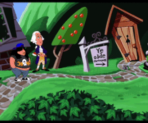

```{r setup, global_options,include=FALSE}
knitr::opts_chunk$set(
  dpi = 200,
  #fig.width = 7,
  #fig.height = 4,
  strip.white = T,
  #dev = "png",
  #dev.args = list(png = list(bg = "transparent")),
  message=FALSE,
  comment=NA,
  echo=FALSE,
  warning=FALSE,
  eval=TRUE
  
)
```

```{r include=FALSE}
source('./assets/functions.R')

# Les librairies
requiredPackages = c('knitr','kableExtra','reshape','ggplot2','ggthemes','dplyr',
                     'dotenv')

PackageFacile(requiredPackages)

load_dot_env(".env")
annee=Sys.getenv("annee")


```


class: center, middle, inverse, title-slide, animated, fadeIn
# Analyse de données L3 `r annee`
# Cours n°7- La Classification Ascendante Hiérarchique<br /> <br />
### Florian Bayer


<div class="my-footer"><span>Université Paris 1 Panthéon Sorbonne - L3 `r annee` : analyse de données - Florian Bayer</span></div> 


---
class: animated, fadeIn
## Principes
<div class="my-footer"><span>Université Paris 1 Panthéon Sorbonne - L3 `r annee` : analyse de données - Florian Bayer</span></div> 

En analyse de données, on cherche souvent à simplifier des résultats en regroupant les individus qui se **ressemblent**, tout en faisant en sorte de **séparer** ceux qui sont les plus différents. L'utilisation de **classes** est alors nécessaire :
- l’intérieur des classes est homogène (minimisation de la variance intraclasse)
- les classes sont hétérogènes les unes par rapport aux autres (maximisation de la variance interclasse)


Ce principe est facilement applicable lorsque l'on souhaite classer les individus en fonction d'une seule variable : c'est la **discrétisation**.  

Mais appliquer les méthodes de discrétisation conjointement sur deux ou plusieurs variables (le taux de chômage, la densité de médecins etc.) est beaucoup plus complexe.

---
class: animated, fadeIn
## Principes
<div class="my-footer"><span>Université Paris 1 Panthéon Sorbonne - L3 `r annee` : analyse de données - Florian Bayer</span></div> 

Il existe des méthodes qui permettent de regrouper les individus qui disposent du même **profil** au sein de classe : 
- Classe 1 : taux de chômage <span style="color:#c0504d">**élevé**</span> et densité de médecins <span style="color:#c0504d">**élevé**</span>
- Classe 2 : taux de chômage <span style="color:#9bbb59">**faible**</span> et densité de médecins <span style="color:#c0504d">**élevé**</span>
- Classes 3 : taux de chômage <span style="color:#9bbb59">**faible**</span> et densité de médecins <span style="color:#9bbb59">**faible**</span>

La **Classification Ascendante Hiérarchique** (CAH) est une de ces méthodes. Elle permet de créer des regroupements, des **typologies** : 
- Avoir une vision plus globale de la **différenciation**, parfois spatiale, des individus géographiques
- Associer à chaque classe un type généralisant les éléments de la classe.

---
class: animated, fadeIn
## Typologies : climats
<div class="my-footer"><span>Université Paris 1 Panthéon Sorbonne - L3 `r annee` : analyse de données - Florian Bayer</span></div> 

.center-img[
```{r echo=FALSE, out.width="90%"}

```
]


---
class: animated, fadeIn
## Classification phylogénétique cladistique
<div class="my-footer"><span>Université Paris 1 Panthéon Sorbonne - L3 `r annee` : analyse de données - Florian Bayer</span></div> 

.center-img[
```{r echo=FALSE, out.width="65%"}

```
]

---
class: animated, fadeIn
## Profils des IRIS parisiens
<div class="my-footer"><span>Université Paris 1 Panthéon Sorbonne - L3 `r annee` : analyse de données - Florian Bayer</span></div> 

.center-img[
```{r echo=FALSE, out.width="50%"}

```
]


---
class: inverse, center, middle, animated, fadeIn  
# 1- Principes de la CAH


<div class="my-footer-title "></div> 

---
class: animated, fadeIn
## Ressemblance et différence
<div class="my-footer"><span>Université Paris 1 Panthéon Sorbonne - L3 `r annee` : analyse de données - Florian Bayer</span></div> 

Dans une classification, l’information globale est égale aux **ressemblances** + les **différences**:

.center-img[
```{r echo=FALSE, out.width="100%"}

```
]

- On cherche des groupes homogènes : à l’intérieur de chaque groupe, les individus se **ressemblent** plus entre eux qu’ils ne ressemblent aux groupes voisins.
- Tout en faisant en sorte que chaque groupe pris individuellement soit très **différent** des autres.

---
class: animated, fadeIn
## Mesure par les individus
<div class="my-footer"><span>Université Paris 1 Panthéon Sorbonne - L3 `r annee` : analyse de données - Florian Bayer</span></div> 

Pour mesurer les différences et ressemblances avec une CAH, on regarde les **profils** des individus (entrée par les individus).
.pull-left[
```{r echo=FALSE, out.width="100%"}
df.ex <- data.frame("Nom" = c('Tanzanie','Djibouti','Éthiopie'),
           'Densité' = c(33,27,54),
           "Taux urb." = c(28,83,18),
           "Part jeune" = c(45,41,46))

df.ex %>%
  kable() %>%
  kable_styling(font_size = 12)

```
.font85[ 
- Les profils de la Tanzanie et de l’Ethiopie sont relativement proches, à l’exception d’une densité plus importante pour l’Ethiopie (33 vs 54).
- Djibouti possède également un profil similaire, mais avec un taux d’urbanisation beaucoup plus important (83%, contre 28 et 18 % pour la Tanzanie et l’Ethiopie).

Dans la CAH, les classes seront construites en fonction des caractéristiques de chaque profil.]
]
.pull-right[
```{r echo=FALSE, out.width="100%"}

melt.ex <- melt(df.ex, id.vars="Nom")

p<-ggplot(data=melt.ex, aes(x=Nom, y=value, fill = variable)) +
  geom_bar(stat="identity", position = 'dodge') + 
  coord_flip() +  scale_fill_manual(values=c("#1f77b4", "#ff7f0e", "#d62728"))
p 

```
]

---
class: animated, fadeIn
## Principe
<div class="my-footer"><span>Université Paris 1 Panthéon Sorbonne - L3 `r annee` : analyse de données - Florian Bayer</span></div> 

La CAH tente de regrouper les individus en fonction de leur **degré de ressemblance** (profils), jusqu’à obtenir une classe les regroupant tous.

Ce processus se fait via une méthode dite **itérative** (algorithme):
1. On calcule les **distances** des individus entre eux (nuage de points ou tableau).
2. On sélectionne les deux premiers individus qui se ressemblent le plus en fonction des variables de l’analyse. Ce sont donc les deux individus les plus **proches** en terme de distance.
3. Un **nouveau groupe** est créé, contenant les 2 individus précédents. Les autres individus sont chacun dans une classe spécifique.
4. Soit on cherche l’individus le plus proche de ce nouveau groupe, puis on l’agrège à ce groupe ou bien on créé un nouveau groupe. Cela dépend à chaque fois de la **distance minimale** entre les points ou entre les groupes.
5. On **répète** l’opération jusqu’à ce qu’il n’y a plus qu’une seule classe.

---
class: animated, fadeIn
## Choix des paramètres
<div class="my-footer"><span>Université Paris 1 Panthéon Sorbonne - L3 `r annee` : analyse de données - Florian Bayer</span></div> 

La méthode de classification itérative suppose de définir en amont deux paramètres:

.pull-left[
.center[**Un critère de ressemblance (distance)**]
- La métrique **euclidienne** s’utilise sur des tableaux élémentaires (même type de tableau que pour l’ACP)
- La métrique du $\chi2$ sera utilisé pour les tableaux de contingences (une différence de 1 à 5 n'est pas pareille qu'une différence entre 100 et 105)
]

.pull-right[
.center[**Un critère d’agrégation**]
- Il existe de nombreux critères d’agrégation, mais de manière générale, on utilise le critère dit de **Ward** (selon l’inertie). Il minimise la variance intraclasse et maximise la variance interclasse.
]

---
class: animated, fadeIn
## Algorithme 1
<div class="my-footer"><span>Université Paris 1 Panthéon Sorbonne - L3 `r annee` : analyse de données - Florian Bayer</span></div> 

.pull-left[
Le logiciel détermine la matrice de distance entre chaque individus.
]

.pull-right[.center-img[
```{r echo=FALSE, out.width="100%"}

```
]]

---
class: animated, fadeIn
## Algorithme 2
<div class="my-footer"><span>Université Paris 1 Panthéon Sorbonne - L3 `r annee` : analyse de données - Florian Bayer</span></div> 

.pull-left[
Le logiciel détermine les deux individus qui se ressemblent le plus dans le nuage de point.

Dans l’exemple, on prend les deux points les plus proches pour former le <span style="color:#c0504d">1er groupe</span>.
]

.pull-right[.center-img[
```{r echo=FALSE, out.width="100%"}

```
]]

---
class: animated, fadeIn
## Algorithme 3
<div class="my-footer"><span>Université Paris 1 Panthéon Sorbonne - L3 `r annee` : analyse de données - Florian Bayer</span></div> 

.pull-left[
Une première classe est formée, les autres individus étant seuls. 

On détermine le centre de gravité du premier groupe <span style="color:#c0504d">(croix rouge)</span>, puis on recherche l’individu le plus proche de ce dernier.

On forme ainsi le <span style="color:#f79646">groupe 2</span>, qui contient le  <span style="color:#c0504d">1er groupe</span> + le nouvel individu.
]

.pull-right[.center-img[
```{r echo=FALSE, out.width="100%"}

```
]]

---
class: animated, fadeIn
## Algorithme 4
<div class="my-footer"><span>Université Paris 1 Panthéon Sorbonne - L3 `r annee` : analyse de données - Florian Bayer</span></div> 

.pull-left[
On détermine le centre de gravité de ce nouveau <span style="color:#f79646">groupe 2 (croix orange)</span> puis on recherche l’individu le plus proche de ce dernier. 

On se rend compte que la distance entre le centre de gravité du Groupe 2 est plus grande que la distance entre les deux points en haut du nuage. 

On forme donc un troisième groupe à partir de ces deux derniers points <span style="color:#8064a2">(groupe 3)</span>.
]

.pull-right[.center-img[
```{r echo=FALSE, out.width="100%"}

```
]]

---
class: animated, fadeIn
## Algorithme 5
<div class="my-footer"><span>Université Paris 1 Panthéon Sorbonne - L3 `r annee` : analyse de données - Florian Bayer</span></div> 

.pull-left[
Le dernier regroupement <span style="color:#9bbb59">(groupe 4)</span> contient tous les individus, l’analyse se termine.

La croix verte correspond au centre de gravité du dernier regroupement.
]

.pull-right[.center-img[
```{r echo=FALSE, out.width="100%"}

```
]]

---
class: animated, fadeIn
## Hiérarchie
<div class="my-footer"><span>Université Paris 1 Panthéon Sorbonne - L3 `r annee` : analyse de données - Florian Bayer</span></div> 

.pull-left[
Cet algorithme va permettre de créer un **arbre hiérarchique** (dendrogramme), qui n’est autre que le résumé des différentes opérations précédentes. Il permettra de déterminer le nombre de classes.
- On y trouvera au début l’ensemble des individus.
- Puis chaque regroupement représenté 2 à 2.
- Ainsi que l’inertie qui sépare les regroupement (longueur de branches de l’arbre).
- Le dernier regroupement comprend tous les individus.
]

.pull-right[.center-img[
```{r echo=FALSE, out.width="100%"}
knitr::include_graphics("./assets/images/9-CAH/hierarchie.png")
```
]]

---
class: animated, fadeIn
## Etape 1 : 5 individus, 5 classes
<div class="my-footer"><span>Université Paris 1 Panthéon Sorbonne - L3 `r annee` : analyse de données - Florian Bayer</span></div> 

.center-img[
```{r echo=FALSE, out.width="100%"}

```
]

---
class: animated, fadeIn
## Etape 2 : 5-1 classes = 4 classes
<div class="my-footer"><span>Université Paris 1 Panthéon Sorbonne - L3 `r annee` : analyse de données - Florian Bayer</span></div> 

.center-img[
```{r echo=FALSE, out.width="100%"}

```
]

---
class: animated, fadeIn
## Etape 3 : 5-2 classes = 3 classes
<div class="my-footer"><span>Université Paris 1 Panthéon Sorbonne - L3 `r annee` : analyse de données - Florian Bayer</span></div> 

.center-img[
```{r echo=FALSE, out.width="100%"}

```
]

---
class: animated, fadeIn
## Etape 4 : 5-3 classes = 2 classes
<div class="my-footer"><span>Université Paris 1 Panthéon Sorbonne - L3 `r annee` : analyse de données - Florian Bayer</span></div> 

.center-img[
```{r echo=FALSE, out.width="100%"}

```
]

---
class: animated, fadeIn
## Etape 5 : 5-4 classes = 1 classe
<div class="my-footer"><span>Université Paris 1 Panthéon Sorbonne - L3 `r annee` : analyse de données - Florian Bayer</span></div> 

.center-img[
```{r echo=FALSE, out.width="100%"}

```
]

---
class: animated, fadeIn
## Remarques
<div class="my-footer"><span>Université Paris 1 Panthéon Sorbonne - L3 `r annee` : analyse de données - Florian Bayer</span></div> 

Avec la CAH, un individu ne peut appartenir qu’à une **seule classe**. De plus les partitions sont hiérarchisées et emboitées : 
- au niveau le plus fin, chaque individu correspond à une classe.
- Au niveau le plus agrégé, une seule classe comprend tous les individus

Cela implique des modifications au niveau de l’**inertie** (=variance =information). 

On la décompose en 2 ensembles : l’inertie **intraclasse** et l’inertie **interclasse**.
- S’il y a autant de classe que d’individus, l’inertie est **minimale à l’intérieur** de chaque classe, **maximale entre les classes**
- Plus on regroupe l’information en classe, plus elle résumée et simple, mais également **hétérogène** à l’intérieur des classes (les classes peuvent contenir des individus très différents les uns des autres). Dans ce cas, l'inertie intraclasse **augmente** au **détriment** de l'inertie interclasse.

---
class: inverse, center, middle, animated, fadeIn  
# 2- L'inertie


<div class="my-footer-title "></div> 

---
class: animated, fadeIn
## Inertie : 11 classes
<div class="my-footer"><span>Université Paris 1 Panthéon Sorbonne - L3 `r annee` : analyse de données - Florian Bayer</span></div> 

.pull-left[
Chaque point <span style="color:#2a6099">**bleu**</span> correspond à la position d’un individu dans le nuage de point. Le point <span style="color:#c0504d">**rouge**</span> correspond au centre de gravité du nuage. 

L’inertie totale correspond à la somme des <span style="color:#999999">**distances**</span> entre les <span style="color:#2a6099">**individus**</span> et le <span style="color:#c0504d">**centre de gravité**</span>

S’il y a autant de classes que d’individus (un point bleu = une classe) : la variance intraclasse est **minimale** et la variance interclasse **maximale.** Aucune information n'est résumée et toute l'information initiale sera présente sur la carte.
]

.pull-right[.center-img[
```{r echo=FALSE, out.width="100%"}

```
]]

Inertie totale = inertie intraclasse (nulle) + <span style="color:#999999">inertie interclasse (forte)</span>

Information totale = 0 + <span style="color:#999999">Somme des distances au centre de gravité</span>

---
class: animated, fadeIn
## Inertie : 3 classes
<div class="my-footer"><span>Université Paris 1 Panthéon Sorbonne - L3 `r annee` : analyse de données - Florian Bayer</span></div> 

.pull-left[

En créant 3 classes, on commence à résumer l'information puisque l'inertie interclasse va baisser et celle intraclasse augmenter.

La somme des longueurs des traits <span style="color:#999999">**gris**</span> correspond à l'inertie interclasse, qui est beaucoup **moins** importante que dans l'exemple précédent.

La somme des longueurs des traits <span style="color:#ff7f0e">**orange**</span> correspond à l'inertie intraclasse. Elle est **plus** importante que précédemment. L'information sera moyennement résumée sur la carte.

]

.pull-right[.center-img[
```{r echo=FALSE, out.width="100%"}

```
]]

Inertie totale = <span style="color:#ff7f0e">inertie intraclasse (moyenne)</span> + <span style="color:#999999">inertie interclasse (moyenne)</span>

---
class: animated, fadeIn
## Inertie : 2 classes
<div class="my-footer"><span>Université Paris 1 Panthéon Sorbonne - L3 `r annee` : analyse de données - Florian Bayer</span></div> 

.pull-left[

On réduit le nombre de classes à 2. 

L’inertie interclasse baisse puisque la <span style="color:#999999">**somme des distances**</span> aux centres des classes diminue.

A l'inverse, <span style="color:#ff7f0e">**l'inertie intraclasse augmente**</span>. De plus, la classe de gauche devient plus hétérogène, avec des points de plus en plus éloignés du centre de la classe. L'information sera fortement résumée sur la carte.
]

.pull-right[.center-img[
```{r echo=FALSE, out.width="100%"}

```
]]

Inertie totale = <span style="color:#ff7f0e">inertie intraclasse (forte)</span> + <span style="color:#999999">inertie interclasse (faible)</span>

---
class: animated, fadeIn
## Inertie : résumé 
<div class="my-footer"><span>Université Paris 1 Panthéon Sorbonne - L3 `r annee` : analyse de données - Florian Bayer</span></div> 

Il est donc nécessaire de trouver un **équilibre** entre **résumé** de l'information (diminution de l'inertie interclasse) et des classes **homogènes** (inertie intraclasse la plus faible possible).

Trop de classes et l’information ne sera pas résumée ; on met en avant les spécificité individuelles, sans comprendre qui ressemble à qui.
- C'est le cas lorsque inertie interclasse est forte et celle intraclasse faible.

Peu de classes et l’information sera trop résumée. Les classes seront très hétérogènes (les individus qui la composent ne se ressemblent peut-être pas)  
- C'est le cas lorsque l'inertie interclasse est faible et l'inertie intraclasse forte.

Le choix du nombre de classes et l’analyse de l’inertie est donc essentielle.

---
class: inverse, center, middle, animated, fadeIn  
# 3- Déterminer le nombre de classes


<div class="my-footer-title "></div> 

---
class: animated, fadeIn
## Couper l'arbre !
<div class="my-footer"><span>Université Paris 1 Panthéon Sorbonne - L3 `r annee` : analyse de données - Florian Bayer</span></div> 

.pull-left[
Pour obtenir les classes, il suffit de **couper** l’arbre hiérarchique.
Comme l’objectif de la classification est de conserver un bon compromis entre la variance interclasse (pour simplifier l’information) et intraclasse (pour regrouper les individus qui se ressemblent le plus), on coupe le plus souvent après le plus grand **saut** de l’arbre.
- Un trop grand nombres de classes réduirait l’intérêt de la classification puisqu’on ne résumerait plus l’information.
- Un trop petit nombre de classes produirait des résumés trop grossiers (classe très hétérogènes à l’intérieur).
Dans tous les cas, le choix du nombre de classes se fait à posteriori.
]

.pull-right[
.center-img[
```{r echo=FALSE, out.width="100%"}

```
]]


---
class: animated, fadeIn
## 4 classes
<div class="my-footer"><span>Université Paris 1 Panthéon Sorbonne - L3 `r annee` : analyse de données - Florian Bayer</span></div> 

.center-img[
```{r echo=FALSE, out.width="100%"}

```
]

---
class: animated, fadeIn
## 3 classes
<div class="my-footer"><span>Université Paris 1 Panthéon Sorbonne - L3 `r annee` : analyse de données - Florian Bayer</span></div> 

.center-img[
```{r echo=FALSE, out.width="100%"}

```
]

---
class: animated, fadeIn
## 2 classes
<div class="my-footer"><span>Université Paris 1 Panthéon Sorbonne - L3 `r annee` : analyse de données - Florian Bayer</span></div> 

.center-img[
```{r echo=FALSE, out.width="100%"}

```
]

---
class: animated, fadeIn
## Remarques
<div class="my-footer"><span>Université Paris 1 Panthéon Sorbonne - L3 `r annee` : analyse de données - Florian Bayer</span></div> 

Couper après le saut le plus grand permet de **justifier** le nombre de classes choisi, mais ce nombre peut ne pas être en adéquation avec vos objectifs.

Vous pouvez choisir **manuellement** un nombre de classes si jamais l’interprétation des résultats devient plus pertinente. Pour cela, vous pouvez vous aider des profils des classes (cf. chapitre suivant).

Pensez également à prendre en compte le compromis entre inertie expliquée et la **représentation cartographique** (max 6 ou 7 classes).

Enfin, certains logiciels comme SAS proposent un test de **Fisher** pour déterminer le nombre de classes optimal. Ce test correspond généralement à un découpage de l’arbre hiérarchique après le plus grand saut. S’il n’apporte pas beaucoup d’information en plus, c’est un bon moyen de justifier le choix du nombre de classes dans un article scientifique.


---
class: inverse, center, middle, animated, fadeIn  
# 4- Mise en place et interprétation des résultats


<div class="my-footer-title "></div> 

---
class: animated, fadeIn
## Méthodologie de mise en œuvre d’une CAH
<div class="my-footer"><span>Université Paris 1 Panthéon Sorbonne - L3 `r annee` : analyse de données - Florian Bayer</span></div> 

- Formulation de la problématique
- Sélection des données permettant d’y répondre
- Analyse univariée et calcul du profil moyen de la zone d’étude (la moyenne de chaque variable)
- Analyse bivariée pour supprimer d’éventuelles variables trop redondantes. Permet de simplifier l’interprétation, mais vous pourriez perdre certaines spécificités locales
- Calcul de la CAH
- Sélection du nombre de classes à l’aide de l’arbre hiérarchique
- Interprétation des profils de chaque classe
- Cartographie des résultats

---
class: animated, fadeIn
## Données
<div class="my-footer"><span>Université Paris 1 Panthéon Sorbonne - L3 `r annee` : analyse de données - Florian Bayer</span></div> 

Les méthodes de classification peuvent être réalisées sur des **tableaux élémentaires de données**. On sélectionne simplement les variables à inclure dans l’analyse. La distance à utiliser sera alors la distance **euclidienne.** Comme pour l’ACP, il est préférable de supprimer les variables fortement corrélées entre elles.

On peut également réaliser une CAH sur un tableau de contingence. Dans ce cas, on utilisera une distance du $\chi2$.

Les CAH peuvent également être réalisées sur des résultats d’analyses factorielles :
- L’ACP ou l’AFC permet de réorganiser les données et de comprendre comment elles interagissent les une par rapport aux autres. Il faut cependant analyser tous les facteurs un à un.
- La classification se fait alors sur tous les facteurs et permet de traiter 100% de l’information du tableau de départ.

---
class: animated, fadeIn
## Le profil moyen
<div class="my-footer"><span>Université Paris 1 Panthéon Sorbonne - L3 `r annee` : analyse de données - Florian Bayer</span></div> 

Il est **obligatoire** de calculer le **profil moyen** de chaque variable (la moyenne de chaque variable). En effet, les résultats de la CAH s'expriment en écart à la moyenne.

Profil moyen de la densité de population, du taux d’urbanisation, de la part des actifs agricoles, du % de moins de 20 ans et de plus de 60 ans dans les pays Africains en 1999 :

```{r echo=FALSE, out.width="100%"}
df.ex <- data.frame("Nom" = c('Profil Moyen'),
           'DEN99' = c(41.6),
           "URB00." = c(40.8),
           "AGR00" = c(61.4),
           "JEU99" = c(43.7),
           "VIE99" = c(3.4))


df.ex %>%
  kable() %>%
  kable_styling(font_size = 14)

```

---
class: animated, fadeIn
## Les sorties
<div class="my-footer"><span>Université Paris 1 Panthéon Sorbonne - L3 `r annee` : analyse de données - Florian Bayer</span></div> 

Les sorties usuelles d’une CAH sont : 
- L’arbre hiérarchique et les valeurs associées.
- Les caractéristiques de chaque classe.

Il existe généralement une sortie pour chaque partition :
- Une sortie pour la partition en 2 classes.
- En 3 classes.
- En 4 classes etc.

Chacune de ces sorties contient le profil de chaque classe, exprimé en écart type par rapport à la moyenne (le profil moyen).

---
class: animated, fadeIn
## Les sorties : arbre hiérarchique
<div class="my-footer"><span>Université Paris 1 Panthéon Sorbonne - L3 `r annee` : analyse de données - Florian Bayer</span></div> 

L’arbre hiérarchique montre les sauts de **l’inertie perdue** dans la différenciation des classes (inertie interclasse). 
Dans l’exemple ci-dessous, plus on va vers la gauche, plus le nombre de classes est important. 

Si on coupe après le premier saut (barre rouge à droite), on obtiendra 2 classes (on compte le nombre de traits que la barre coupe). Il n'y a que 43,57% de l'information totale en interclasse, donc 56,73% de l'information qui se trouve dans les classes. L'information est donc très résumée.

.center-img[
```{r echo=FALSE, out.width="100%"}
knitr::include_graphics("./assets/images/9-CAH/Arbre02classes.svg")
```
]

---
class: animated, fadeIn
## Les sorties : arbre hiérarchique
<div class="my-footer"><span>Université Paris 1 Panthéon Sorbonne - L3 `r annee` : analyse de données - Florian Bayer</span></div> 

Si on coupe après le second saut, on obtiendra 3 classes. Il y a 57,62% de l'information dans l'inertie en interclasse, donc 42,.8% de l'information qui se trouve dans les classes. L'information est donc un peu moins résumée que précédemment.

.center-img[
```{r echo=FALSE, out.width="100%"}

```
]

---
class: animated, fadeIn
## Les sorties : arbre hiérarchique
<div class="my-footer"><span>Université Paris 1 Panthéon Sorbonne - L3 `r annee` : analyse de données - Florian Bayer</span></div> 

Avec 12 classes, l'information est treu peu résumé : il y a 90,27% de l'information totale en interclasse, donc 9,73% de l'information qui se trouve dans les classes. 

.center-img[
```{r echo=FALSE, out.width="100%"}
knitr::include_graphics("./assets/images/9-CAH/Arbre12classes.svg")
```
]

---
class: animated, fadeIn
## Caractéristiques de chaque classe
<div class="my-footer"><span>Université Paris 1 Panthéon Sorbonne - L3 `r annee` : analyse de données - Florian Bayer</span></div> 

Les logiciels vous fourniront une analyse univariée par découpage (2, 3, 4, n classes): **nombre d’individus dans chaque classe**, min, max, **moyenne**, CV, **distance au profil moyen exprimé en écart-type**.

.center-img[
```{r echo=FALSE, out.width="80%"}

```
]

---
class: animated, fadeIn
## Caractéristiques de chaque classe
<div class="my-footer"><span>Université Paris 1 Panthéon Sorbonne - L3 `r annee` : analyse de données - Florian Bayer</span></div> 

**C’est la distance aux moyennes exprimée en écart-type** qui permet d’interpréter les classes. Elle peut être accompagnée d’une aide à l’interprétation sous forme d’histogramme. On compare donc pour **chaque variable de chaque classe** l'écart à la **moyenne globale** (les pays Africains). C'est donc une comparaison relative.

.center-img[
```{r echo=FALSE, out.width="100%"}
knitr::include_graphics("./assets/images/9-CAH/sortie_univ2.png")
```
]

---
class: animated, fadeIn
## Interprétation
<div class="my-footer"><span>Université Paris 1 Panthéon Sorbonne - L3 `r annee` : analyse de données - Florian Bayer</span></div> 

.font90[
On interprète les classes comme des **sur/sous représentations **par rapport à la **MOYENNE** de l’ensemble des individus.

Le profil de la classe 1 est relativement **proche du profil moyen** (tous les écarts sont petits). Par exemple, la moyenne de la variable densité dans cette classe est proche de la moyenne globale <span style="color:#c0504d">(distance faible et positive)</span>. On a vu dans le tableau 3.4 qu’elle valait 44,18 ; <span style="color:#f79646">41,6</span> pour l’ensemble des individus.

La classe 2 à une moyenne pour la variable densité également proche de la moyenne globale,mais un peu plus faible (30,7). La distance reste toutefois faible <span style="color:#8064a2">(-0,5 ect)</span>. En revanche, on note une forte sous représentation des actifs du secteur agricole par rapport au profil moyen <span style="color:#9bbb59">(distance inférieure = -1,5ect)</span>. La moyenne de cette variable est en effet de 27,01% contre <span style="color:#2a6099">61,4%</span> pour l’ensemble des individus. Même constant pour la part des moins de 20 ans (JEU99). A l’opposé, on note une forte surreprésentation du % de 60 ans et plus dans la population totale et une nette surreprésentation du taux d’urbanisation.
]

.center-img[
```{r echo=FALSE, out.width="100%"}

```
]


---
class: animated, fadeIn
## Interprétation
<div class="my-footer"><span>Université Paris 1 Panthéon Sorbonne - L3 `r annee` : analyse de données - Florian Bayer</span></div> 

Il n’y a pas de grandes difficultés dans l’interprétation des classes d’une CAH. Il faut cependant être conscient que les résultats ne permettent pas de déterminer si le taux d’urbanisation est beaucoup plus important dans telle ou telle classe.

Vous devez les interpréter comme plus ou moins important **par rapport à la moyenne des individus** de votre étude.

Si la moyenne du taux d’urbanisation est déjà importante pour tous les individus :
- Une surreprésentation montrera que dans la classe concernée, le taux d’urbanisation est encore plus important que la moyenne globale.
- Une sous représentation montrera que dans la classe concernée, le taux d’urbanisation est plus petit que la moyenne, mais pas forcément faible ou nul.

---
class: inverse, center, middle, animated, fadeIn  
# 5- Cartographie

<div class="my-footer-title "></div> 


---
class: animated, fadeIn
## Cartographie
<div class="my-footer"><span>Université Paris 1 Panthéon Sorbonne - L3 `r annee` : analyse de données - Florian Bayer</span></div> 

.pull-left[ .font80[
Les résultats d’une CAH peuvent être cartographiés. L’avantage de cette méthode pour les géographe est qu’elle aboutit souvent à des **régionalisations.** 

La variable cartographiée est l’appartenance d’un individu à une classe. Il s’agit donc d’une variable qualitative nominale.

L’exemple ci-contre montre le résultat d’une CAH sur les pays Africains, avec des données sur la densité de population, le taux d’urbanisation, la part des actif agricoles, la part des moins de 20 ans et des plus de 60 ans.

Avec 2 classes, on explique 44,67% de l’inertie (information) totale.

Si la <span style="color:#c0504d">classe 1</span> est relativement proche du profil moyen (écart faible), la <span style="color:#2a6099">classe 2</span> montre de fortes surreprésentations du taux d’urbanisation et du % des plus de 60 ans, de fortes sous représentation des actifs agricoles et du % de moins de 20 ans
]]

.pull-right[
.center-img[
```{r echo=FALSE, out.width="100%"}

```
]]

---
class: animated, fadeIn
## Cartographie
<div class="my-footer"><span>Université Paris 1 Panthéon Sorbonne - L3 `r annee` : analyse de données - Florian Bayer</span></div> 

.pull-left[ .font80[
Avec 3 classes, 54,86% de l’inertie totale est expliquée par 3 classes contre 44,67 avec 2 classes.
Le profil de la <span style="color:#2a6099">classe 2</span> ne change pas, mais la <span style="color:#c0504d">classe 1</span> précédente se scinde en deux :
- <span style="color:#c0504d">Légère sous représentation de la densité de la population pour la classe 1 et légère sur représentation du taux d’urbanisation par rapport au profil moyen.</span> 
- <span style="color:#9bbb59">Légère sous représentation du taux d’urbanisation et du % des plus de 60 ans dans la classe. Légère surreprésentation du % de moins de 20 ans et des actifs agricoles, par rapport au profil moyen.</span> 
]]

.pull-right[
.center-img[
```{r echo=FALSE, out.width="100%"}

```
]]

---
class: animated, fadeIn
## Cartographie
<div class="my-footer"><span>Université Paris 1 Panthéon Sorbonne - L3 `r annee` : analyse de données - Florian Bayer</span></div> 

.pull-left[ .font90[
Avec 5 classes, 68,7% de l’inertie totale est expliquée par les classes.
A noter la mise en évidence d’un état spécifique (Burundi en rose)
]]

.pull-right[
.center-img[
```{r echo=FALSE, out.width="100%"}

```
]]

---
class: inverse, center, middle, animated, fadeIn  
# Conclusion


<div class="my-footer-title "></div> 

---
class: animated, fadeIn
## Concepts clés
<div class="my-footer"><span>Université Paris 1 Panthéon Sorbonne - L3 `r annee` : analyse de données - Florian Bayer</span></div> 

- Les analyses factorielles permettent de décomposer l’information d’un tableau d’information géographique.
- Les méthodes de classifications permettent de s’intéresser aux combinaisons géographiques de ce tableau, en regroupant les individus (les lignes) semblables et en éloignant les individus (les lignes) différenciés.
- La CAH se base sur un partitionnement du tableau en classe avec des limites distinctes (un individu appartient à une seule classe)
- Elle vise à créer des typologies, en regroupant les individus qui se ressemblent le plus (profils similaires) tout en faisant en sorte d'avoir des classes différentes les unes des autres

---
class: animated, fadeIn
## Exemple
<div class="my-footer"><span>Université Paris 1 Panthéon Sorbonne - L3 `r annee` : analyse de données - Florian Bayer</span></div> 

Exemple avec les CSP en France. Remarquez que les profils bleus se ressemblent, mais avec une intensité différente.

.center-img[
```{r echo=FALSE, out.width="100%"}
knitr::include_graphics("./assets/images/1_Intro/stat3.png")
```
]
