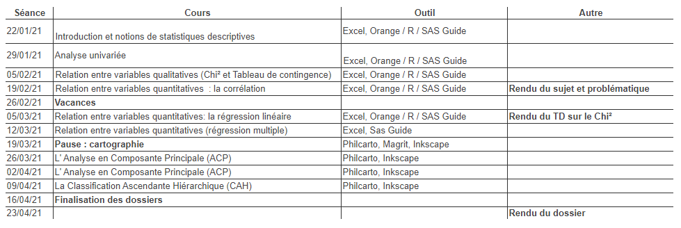
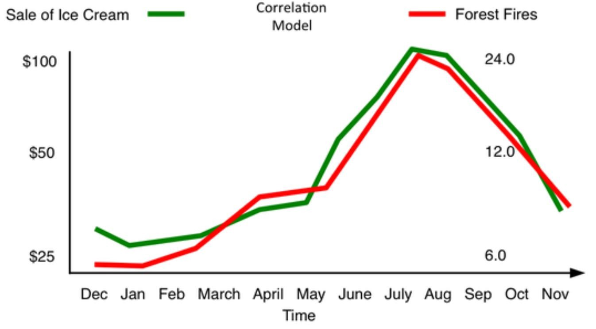
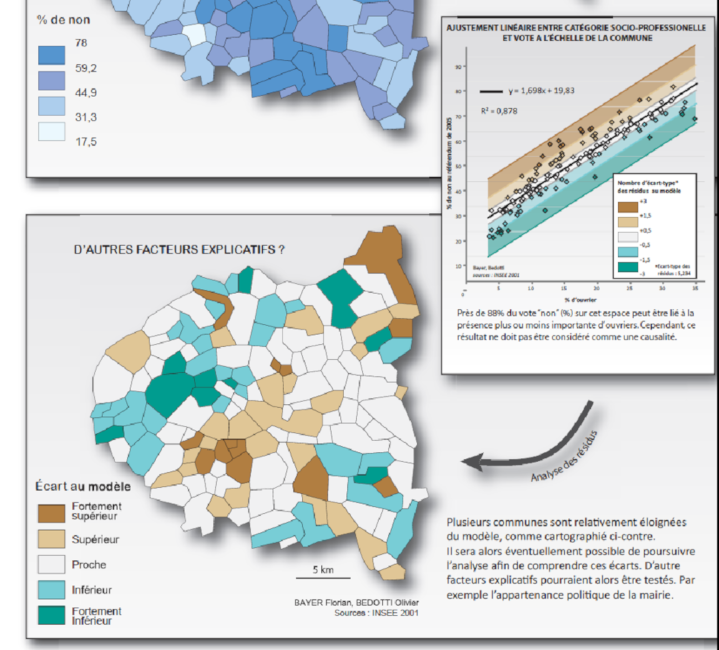
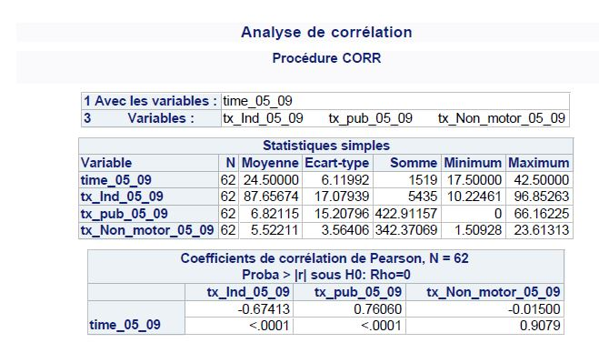
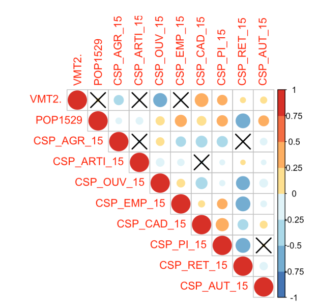
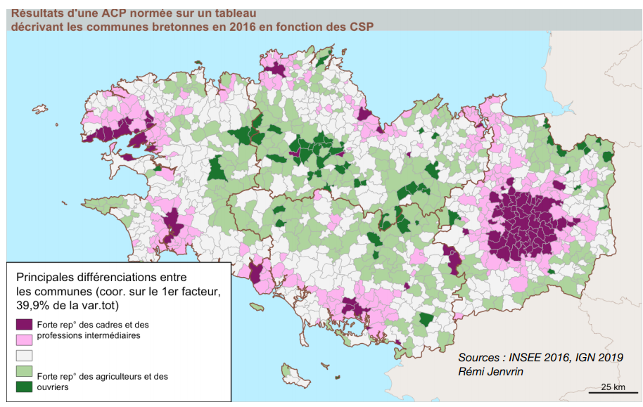
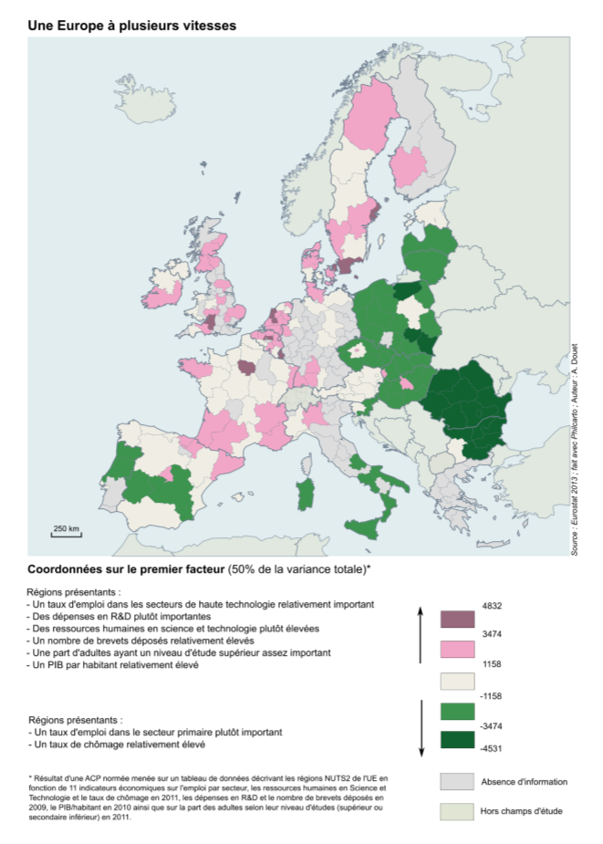
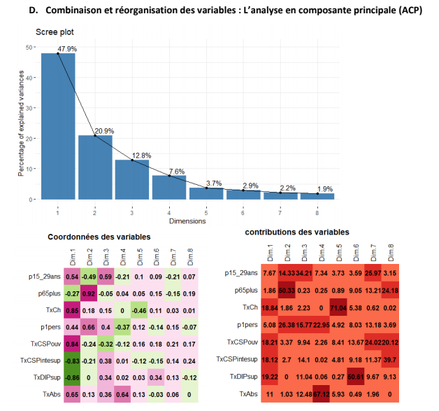
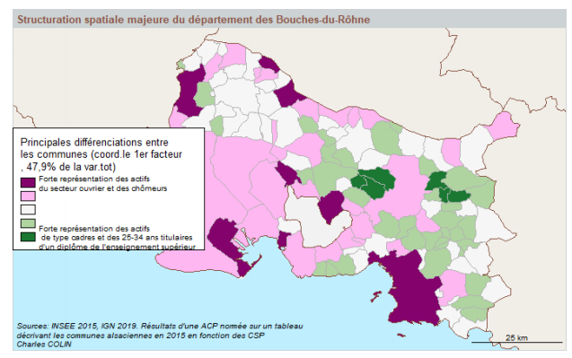

```{r setup, global_options,include=FALSE}
knitr::opts_chunk$set(
  dpi = 200,
  #fig.width = 7,
  #fig.height = 4,
  strip.white = T,
  #dev = "png",
  #dev.args = list(png = list(bg = "transparent")),
  message=FALSE,
  comment=NA,
  echo=FALSE,
  warning=FALSE,
  eval=TRUE
  
)
```

```{r include=FALSE}
source('./assets/functions.R')

# Les librairies
requiredPackages = c('knitr','png','grid','gridExtra',
                     'RColorBrewer','dotenv')

PackageFacile(requiredPackages)

load_dot_env(".env")
annee=Sys.getenv("annee")

```


class: center, middle, inverse, title-slide, animated, fadeIn
# Analyse des données et représentations cartographiques L3 `r annee`
# Présentation du cours <br /> 
### Fiche à remplir : https://cutt.ly/djDpqcK
<br />
### Florian Bayer


<div class="my-footer"><span>Université Paris 1 Panthéon Sorbonne - L3 `r annee` : analyse de données - Florian Bayer</span></div> 

---
class: animated, fadeIn
## Déroulement des séances
   
- 11 séances de 4 heures
- 1 à 2 heures de cours par séance puis travaux dirigés
- Cours, exercices et bibliographie sur l’EPI Paris 1
- florian.bayer@gmail.com

<div class="my-footer"><span>Université Paris 1 Panthéon Sorbonne - L3 `r annee` : analyse de données - Florian Bayer</span></div> 

---
class: animated, fadeIn
## Contenu de l’enseignement
<div class="my-footer"><span>Université Paris 1 Panthéon Sorbonne - L3 `r annee` : analyse de données - Florian Bayer</span></div> 


.pull-left3[
- Acquérir les **bonnes pratiques** de la démarche scientifique
- Tout en gardant un **lien concret** avec ce qui pourra vous être demandé une fois sur le marché du travail
- Principes et méthodes de traitement en **analyse de données**
- Méthodes de **représentation** de l’information statistique en géographie
- Connaissance du processus d’élaboration d’une **étude statistique**
  > - Élaborer une problématique
  > - Rechercher et récolter de données selon la problématique
  > - Identifier et réaliser les méthodes de traitement selon le type de données disponibles
  > - Tester statistiquement ces résultats
  > - Envisager des méthodes de représentation (statistiques et cartographiques);
  > - Analyse des résultats
  > - Autonomie nécessaire pour traiter de gros volumes de données

]

--

.center-img[ .pull-right1[

```{r echo=FALSE, out.width="100%"}
knitr::include_graphics("./assets/images/1_Intro/margaret-hamilton.jpg")
```
.legend[Notes de cours d'une étudiante à la fin du semestre]
]]


---
class: animated, fadeIn
## Evaluation

.pull-left[
**Trois rendus :**
> - Exercice noté (20%)
> - Devoir sur table (20%)
> - Dossier personnel (60%)

]

.pull-right[

**Dossier**
Sujet : Analyse spatio-temporelle des résultats des élections présidentielles 2012-2017

> - Binôme si nécessaire
> - Choisir un ensemble régional formé de plusieurs départements (à faire valider auprès de l’enseignant).
> - Enrichir les données par vous même.
> - Mettre en œuvre les méthodes d’analyse uni-, bi- et multivariées pour décrire et expliquer la géographie électorale de l’espace d’étude.

]

<div class="my-footer"><span>Université Paris 1 Panthéon Sorbonne - L3 `r annee` : analyse de données - Florian Bayer</span></div> 

---
class: animated, fadeIn
## Calendrier prévisionnel

.zoom[
```{r echo=FALSE, out.width="100%"}

```
]

<div class="my-footer"><span>Université Paris 1 Panthéon Sorbonne - L3 `r annee` : analyse de données - Florian Bayer</span></div> 


---
class: inverse, center, middle, animated, fadeIn
# Contenu de l'enseignement

<div class="my-footer-title "></div> 

---
class: animated, fadeIn
## Univarié


- Distinguer les types de **variables**, de **distributions**. **Décrire** une série de données, utiliser les **méthodes appropriées** à chaque type de données.
- Connaître les **principes** et **méthodes** de traitement et d’analyse de données au moyen d’outils de traitement des données (Tableur Excel, XLstat et Philcarto).
- Maîtriser différentes méthodes de **représentation** de l’information statistique en géographie (notamment graphiques et cartographiques).

.center-img[
```{r echo=FALSE, out.width="90%"}
knitr::include_graphics("./assets/images/1_Intro/distrib.png")
```
]


<div class="my-footer"><span>Université Paris 1 Panthéon Sorbonne - L3 `r annee` : analyse de données - Florian Bayer</span></div> 

---
class: animated, fadeIn
## Bivarié

- Mesurer l’**intensité** de la **relation** entre deux variables qualitatives ou quantitatives à l’aide d’un tableau de contingence et de la corrélation.
- **Modéliser** la nature d’une relation entre deux variables à l’aide des analyses de régression linéaire.

.center-img[
```{r echo=FALSE, out.width="70%"}

```
]
<div class="my-footer"><span>Université Paris 1 Panthéon Sorbonne - L3 `r annee` : analyse de données - Florian Bayer</span></div> 

---
class: animated, fadeIn
## Multivarié
Analyse multidimensionnelle
- Analyser la forme et la nature d’une relation entre une variable **indépendante** et **plusieurs variables explicatives** à l’aide de la régression multiple.
- Connaître les deux méthodes **d'analyse factorielle** (ACP et AFC). Savoir les appliquer à un jeu de données et en **interpréter** les résultats.
- Connaître une méthode de **classification** multivariée (la CAH), appliquer, interpréter et représenter ses résultats.

.center-img[
```{r echo=FALSE, out.width="50%"}

```
]

<div class="my-footer"><span>Université Paris 1 Panthéon Sorbonne - L3 `r annee` : analyse de données - Florian Bayer</span></div> 

---
class: animated, fadeIn
## Exemple d'application
<div style="display:table-cell; vertical-align:middle; horizontal-align:center">


.center-img[
```{r echo=FALSE, out.width="100%"}
knitr::include_graphics("./assets/images/1_Intro/stat1.png")
```
]

</div>

<div class="my-footer"><span>Université Paris 1 Panthéon Sorbonne - L3 `r annee` : analyse de données - Florian Bayer</span></div> 

---
class: animated, fadeIn
## Exemple d'application

.center-img[
```{r echo=FALSE, out.width="75%"}

```
] 

<div class="my-footer"><span>Université Paris 1 Panthéon Sorbonne - L3 `r annee` : analyse de données - Florian Bayer</span></div> 

---
class: animated, fadeIn
## Exemple d'application
<div style="display:table-cell; vertical-align:middle; horizontal-align:center">

.center-img[
```{r echo=FALSE, out.width="100%"}
knitr::include_graphics("./assets/images/1_Intro/stat3.png")
```
] 

<div class="my-footer"><span>Université Paris 1 Panthéon Sorbonne - L3 `r annee` : analyse de données - Florian Bayer</span></div> 

---
class: animated, fadeIn
## Exemples de travaux -1

.zoom[ .pull-left[
```{r echo=FALSE, out.width="100%"}

```
]

.pull-right[
```{r echo=FALSE, out.width="100%"}

```
]]

<div class="my-footer"><span>Université Paris 1 Panthéon Sorbonne - L3 `r annee` : analyse de données - Florian Bayer</span></div> 

---
class: animated, fadeIn
## Exemples de travaux -2

.center-img[
```{r echo=FALSE, out.width="100%"}

```
]

<div class="my-footer"><span>Université Paris 1 Panthéon Sorbonne - L3 `r annee` : analyse de données - Florian Bayer</span></div> 

---
class: animated, fadeIn
## Exemples de travaux -3

.center-img[
```{r echo=FALSE, out.width="45%"}

```
]

<div class="my-footer"><span>Université Paris 1 Panthéon Sorbonne - L3 `r annee` : analyse de données - Florian Bayer</span></div> 

---
class: animated, fadeIn
## Exemples de travaux -4

.center-img[
```{r echo=FALSE, out.width="70%"}

```
]

<div class="my-footer"><span>Université Paris 1 Panthéon Sorbonne - L3 `r annee` : analyse de données - Florian Bayer</span></div> 

---
class: animated, fadeIn
## Exemples de travaux -4

.center-img[
```{r echo=FALSE, out.width="90%"}

```
]

<div class="my-footer"><span>Université Paris 1 Panthéon Sorbonne - L3 `r annee` : analyse de données - Florian Bayer</span></div> 


